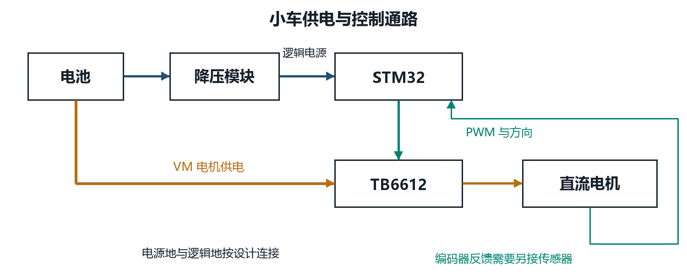
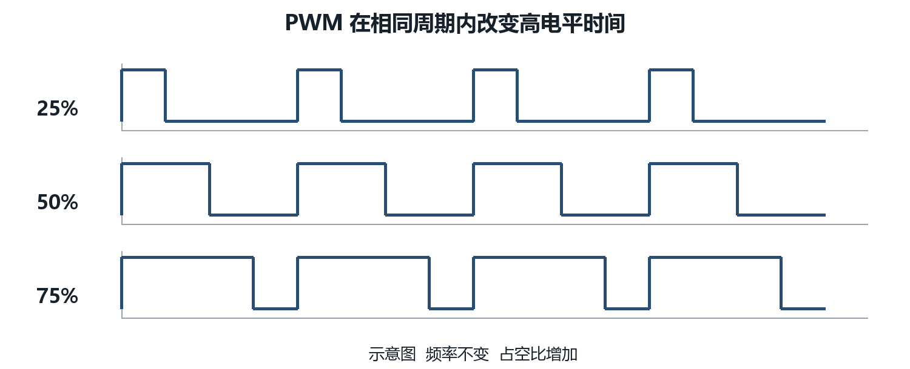
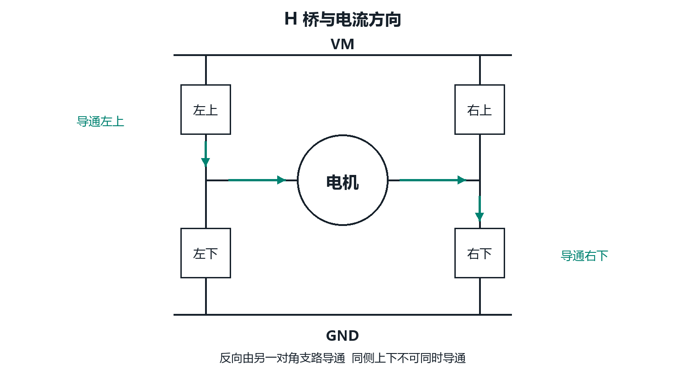
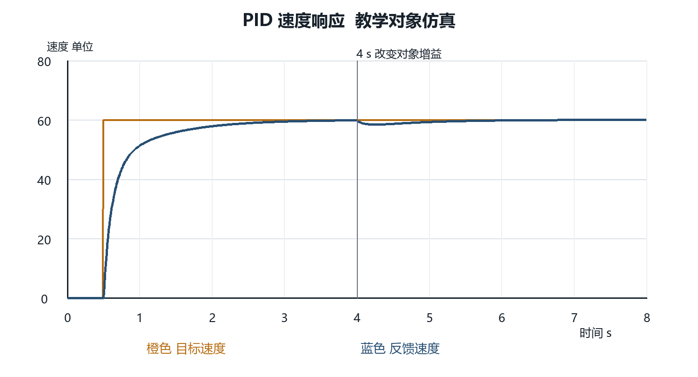

# 机器人电控与人工智能入门培训讲义

面向零基础成员的原理讲解与代码实践

版本 1.1    整理日期 2026 年 10 月 7 日

## 阅读说明

机器人电控的任务，是把人的目标转变成可测量、可执行的机器动作。以小车恒速行驶为例，程序先读取速度，再比较目标与实际值，计算控制量，最后通过驱动器调节电机。C 语言负责表达逻辑，STM32 负责及时运行逻辑，PWM 和通信负责传递指令，PID 负责减少误差。AI 可以帮助机器人感知环境，但还需要可靠的控制系统把预测结果转为动作。

本讲义整合 RoboWalker、WTR 和 Newlegends 三个培训仓库的主题路线，补齐从单片机引入、C 基础到 AI 原理的前置知识。内容和教学代码重新编写；原资料的完整工程、图片、Word 文件和视频不在此重新分发。每章的来源标记可在附录查到。本文不是三个仓库的逐页拼接，也不意味着完成本文就已经掌握其中全部进阶工程。

建议先在电脑上运行 C 例子和 PID 仿真，再上开发板。没有硬件时也可以完成多文件编程、数据帧解析和控制算法实验。AI 部分只介绍原理和应用，不安排模型训练、部署开发或 AI 编程任务。硬件章节以 Keil MDK、STM32F107 和 STM32F10x 标准外设库为教学环境，面向课堂教学与个人自学。芯片完整型号、开发板和晶振尚未指定，引脚连接是教学假设，必须核对原理图、外设和时钟。示例标注“片段”的代码需要加入标准库工程，不能单独烧录。本文不包含已在实物验证的整板固件。

## 课程路线

| 阶段 | 学习章节 | 可以做出的结果 |
| --- | --- | --- |
| 入门 | 第 1 至 2 章 | 解释嵌入式和 MCU，知道程序如何控制硬件 |
| 编程 | 第 3 至 5 章 | 写 C 程序，理解指针，建立 .c 和 .h 工程 |
| 外设 | 第 6 至 9 章 | 点灯、按键、定时、PWM、ADC 和串口 |
| 控制 | 第 10 至 11 章 | 区分驱动方式，理解并运行 PID 仿真 |
| 系统 | 第 12 至 13 章 | 组织任务、处理故障、完成小车系统设计 |
| AI 介绍 | 第 14 至 15 章 | 解释 AI 原理及应用，理解感知与控制的分工 |
| 实践 | 第 16 章与附录 | 按验收项完成练习并整理可发布资料 |

推荐安排 12 次课程，每次约 2 小时，另留实验时间。基础弱的成员应把 C 语言部分拆成多次练习；不要为了赶进度跳过数组、指针或编译过程。课时是教学建议，不是掌握知识的保证。

# 第 1 章 从机器人认识嵌入式

## 1.1 从一个生活事例开始

电饭煲需要测温、控制加热并响应按键；洗衣机需要检测水位、驱动电机并执行不同流程。内部的计算机服务于明确的设备功能，这类系统称为嵌入式系统。它并不一定使用单片机：有的设备使用 MCU，有的使用能够运行 Linux 的处理器，还有的同时使用多种处理器。

机器人小车的控制系统也属于嵌入式系统。遥控器告诉小车“以某个速度向前走”，编码器告诉程序“现在转得多快”，控制程序计算应该给多少驱动力。这里既有软件，也有电源、传感器、通信线路和电机驱动电路。程序正确而接线错误，系统仍然不会工作。

电脑软件经常允许任务稍晚结束；电机控制更关心任务能否在规定时刻完成。比如设计为每 10 ms 更新一次速度，实际更新间隔却在 2 ms 和 100 ms 之间变化，控制效果可能明显变差。实时性指满足时间约束，不是单纯运行得快。记录控制周期及最坏延迟，比只观察平均运行速度更有意义。

## 1.2 控制系统中的信息和能量

信息通路是“目标 → 控制器 → 驱动器 → 电机 → 传感器 → 控制器”。能量通路则是“电源 → 功率器件 → 电机”。STM32 的引脚通常只产生逻辑信号，不能直接为电机提供工作电流。这两个通路必须分清：PWM 是一种控制信号，电机的能量来自电源和驱动器。

把一次控制更新拆开看：读取反馈值；检查反馈是否有效；根据目标和反馈计算误差；计算并限制输出；发送驱动指令；保存状态供下一次更新使用。后面的 PID 章节就是对其中“计算输出”这一步的细化。

## 1.3 一个可讨论的设计事例

需求是“按下按钮后，小车保持 0.5 m/s，松开后停止”。需要先回答：速度由谁测量，按钮如何消抖，电机如何驱动，通信断开时如何停机，软件多久更新一次。只写一个无限循环并反复给电机固定占空比，难以满足恒速要求，因为负载和电池电压会变化。

课堂练习：选一个带电机的设备，分别画出信息通路和能量通路。验收时应能指出处理器、反馈传感器、执行器和功率驱动，而不是把所有模块都叫作“控制板”。

本章主题路线参考 [R1] 电控导论，概念参考 [S1]。

<!--PAGE5_START-->

它们分别负责**计算、存储文件和保存程序**，作用不同：

| 名称 | 中文名称 | 主要作用 | 常见例子 |
|---|---|---|---|
| **CPU** | 中央处理器 | 执行程序指令，处理计算、判断和控制流程 | 运行 C 程序、计算 PID、处理按键 |
| **GPU** | 图形处理器 | 同时进行大量类似的计算，擅长图形处理和 AI 运算 | 渲染游戏画面、处理图像、运行神经网络 |
| **SSD** | 固态硬盘 | 长期保存文件，断电后数据仍在 | 保存系统、软件、照片、代码 |
| **Flash** | 闪存 | 一种断电后仍能保存数据的存储器 | 单片机程序存储器、U 盘、SSD 的存储芯片 |

**SSD 和 Flash 的关系：**SSD 是完整的存储设备，通常包含 NAND Flash 芯片、控制器等；Flash 是一种存储技术。单片机里的程序 Flash 与 SSD 常用的 NAND Flash，具体结构和使用方式也不同。

再补一个容易混淆的 **RAM（运行内存）**：它保存程序运行时的变量和临时数据，通常断电后丢失。SSD 像长期保存资料的文件柜，RAM 像工作时摆放资料的桌面。

放到 **STM32** 里理解：

- **CPU 内核**：执行代码，例如读取转速、计算 PID。
- **Flash**：保存烧录进去的程序和常量，断电后程序还在。
- **SRAM**：保存当前转速、PID 积分值、串口缓冲区等运行数据。
- 本培训常用的 **STM32F103 没有 GPU**，一般也不需要 SSD。

例如 `float speed = 0.0f;`：程序指令通常保存在 Flash 中，运行时 `speed` 变量通常放在 SRAM 中，由 CPU 读取和修改。

<!--PAGE5_END-->

# 第 2 章 单片机与 STM32 的引入

## 2.1 单片机里面有什么

MCU 是 Microcontroller Unit 的缩写，中文通常称单片机或微控制器。它在一颗芯片中集成处理器、存储器和外设。CPU 执行指令，Flash 保存程序，SRAM 保存运行时变量，GPIO 与外部电路交互，定时器负责计时或生成波形，ADC 把模拟电压转为数字值。

程序一般先从 Flash 中取得指令，再使用 SRAM 中的数据。断电后 Flash 通常保留内容，SRAM 通常不保留。芯片上电后先执行启动和运行库初始化，之后才进入 main。对于初学者，可以先从 main 理解应用，但不能认为上电后执行的第一条机器指令就是 main 中的第一行。

| 部件 | 类比 | 在小车中的作用 |
| --- | --- | --- |
| CPU | 执行规则的人 | 计算 PID，解析遥控指令 |
| Flash | 保存规则的笔记 | 保存程序和固定数据 |
| SRAM | 工作草稿纸 | 保存速度、计数和接收缓冲区 |
| GPIO | 开关和观察口 | 控制 LED，读取按键 |
| TIM | 计时器 | 定期运行任务，生成 PWM |
| ADC | 电压读数装置 | 测量分压后的电池电压 |
| UART 与 CAN | 消息通道 | 连接电脑、传感器和驱动器 |

## 2.2 STM32 与 Arm 的关系

STM32 是 STMicroelectronics 的微控制器产品系列名称。许多 STM32 MCU 使用 Arm Cortex-M 处理器内核；Arm 提供内核架构及相关技术，ST 将内核、存储器和外设整合成芯片。具体性能和外设由芯片型号决定，不能把某一块板的配置套到所有 STM32 上。

第 5 页保留了前一次问答原文，其中的 F103 是当时的举例；从本章起，实际教学环境统一为 STM32F107、Keil 和标准外设库。STM32F107 同样没有 GPU。

本讲义用 STM32F107 解释基础外设。F1 系列只是教学基线，并不表示新项目都应选择这个系列。学习其他系列时应重新核对时钟树、引脚复用、DMA 映射、定时器位宽和 CAN 或 FDCAN 的差异。

## 2.3 认识开发板和最小系统

芯片不等于完整开发板。开发板通常增加稳压、电源接口、复位电路、启动配置、晶振及调试接口。最小系统的核心要求是正确供电、去耦、复位和启动条件，外部晶振是否需要由具体设计决定。调试和烧录常使用 SWD，包含 SWDIO、SWCLK、参考电压和地线。

上电前核对电源输入范围和接口定义。不要因为接口长得像 USB，就认为它同时支持数据通信；一些板子的 USB 口只供电。3.3 V 逻辑也不能默认承受任意 5 V 输入，必须查具体引脚的电气规格。开发板、电机驱动板和 USB 转串口模块连接前，先确认地参考和供电方式。

课堂事例：一块板能够点灯，但 ST-LINK 连接失败。排查顺序可以是电源和地 → SWDIO 与 SWCLK → 启动配置 → 调试器设置 → 是否有程序占用了调试引脚。先检查能直接测量的条件，再修改代码。



## 2.4 先认识电压 电流与常用元件

电压描述两个节点之间的电势差，电流描述电荷流动，电阻限制电流。对理想电阻有 V = I × R，电功率 P = V × I。比如 3.3 V 供电、LED 正向压降假设为 2.0 V、目标电流 5 mA，则串联电阻的理想估算为 (3.3 − 2.0) / 0.005 = 260 Ω，应结合实际 LED、电气规格和标准阻值选择。LED 不能简单直接跨接电源。

电容帮助缓冲电压变化，电感帮助缓冲电流变化；二极管通常主要允许一个方向的导通，MOSFET 可以作为受控开关。驱动电机时电感储能和电源瞬态会影响整个系统，所以代码学习应同时了解最基本的元件行为。去耦电容的位置、导线电阻和接地路径都会影响实际效果。

## 2.5 降压模块为什么能给控制板供电

降压模块用于把较高输入电压转换成较低输出电压。例如电池给电机供电，另一路通过合适 DC-DC 模块产生 5 V，再根据控制板设计产生 3.3 V。分压电阻适合信号测量，不能代替稳定的电源给控制板供电，因为负载电流变化会使分压电压变化。

Buck 开关降压电路利用开关、电感和电容传递能量，并通过反馈调整输出。理想连续导通模型中 Vout 约为 D × Vin；实际关系受损耗、负载和控制方式影响。模块里的 PWM 是电源内部工作机制，不是把 STM32 的 PWM 引脚直接当作 5 V 电源。

线性稳压器主要把压差对应的能量变成热，估算损耗为 (Vin − Vout) × Iout。比如 12 V 降到 5 V、负载 0.3 A，理想压差损耗约 2.1 W，需要认真考虑散热。开关降压通常效率较高，但带来纹波和开关噪声，应按负载要求选择方案。

一个供电计算事例：控制部分需要 5 V、0.4 A，输出功率 2 W；假设转换效率 90%，输入电压 12 V，平均输入电流估算约为 2 / (12 × 0.9) = 0.185 A。输出电流不等于输入电流；效率也会随负载变化，这个数只是估算。

| 选型项目 | 为什么要检查 |
| --- | --- |
| 输入电压范围 | 覆盖电池充满和低电量条件 |
| 输出电压与精度 | 匹配控制板和外设要求 |
| 持续输出能力 | 考虑负载峰值、散热和降额 |
| 纹波与瞬态 | 电机动作时避免 MCU 复位或测量异常 |
| 保护与启动行为 | 核对欠压、过流及启动过冲 |

可调模块在未接控制板前，先给模块供电并测量输出，再接合适测试负载核对电压。调整旋钮方向因模块而异，不能猜测。输入输出极性必须核对；示波器探头地夹通常连接保护地，测量前先确认不会把浮动节点短路到地。电机大电流回路和敏感测量回路应合理布线，不能仅凭“已经共地”就认定噪声已经解决。

## 2.6 测量电桥和 H 桥不是同一用途

H 桥用于控制功率流向和电机方向，详见第 10 章。惠斯通电桥则用四个电阻构成两个分压支路，测量两个中点的电压差，常用于检测很小的电阻变化，例如应变片称重。

约定左支路上方 R1、下方 R2，右支路上方 R3、下方 R4，上端供电 Vexc、下端地，则左中点 VL = Vexc × R2 / (R1 + R2)，右中点 VR = Vexc × R4 / (R3 + R4)，桥输出定义为 VL − VR。平衡条件是 R1/R2 = R3/R4。改变测量正负端时输出符号也会反过来。

手算事例：四个电阻原来都为 1000 Ω，激励 3.3 V，两个中点均为 1.65 V；若只有左下 R2 变为 1001 Ω，差分输出约为 0.825 mV。信号很小，实际需要适当放大、差分采样及校准。不能默认普通 MCU ADC 直接测量就能满足称重精度要求。

课堂练习：解释为什么 H 桥的目标是驱动负载，测量电桥的目标是检测变化；再说明为什么降压模块和电阻分压也不能互相替代。

本章参考 [R2] STM32 基础路线及 [S1] 官方入门资料。供电和测量主题为新增，延伸阅读见 [S12] 与 [S13]。

## 2.7 从引脚名字读懂硬件

芯片引脚、开发板排针和模块接口的标记可能不同。芯片数据手册中的 VDD 是芯片电源引脚，开发板上的 5V 可能先经过稳压器再成为芯片的 3.3 V；两者不能直接画等号。接线前先看模块原理图和具体型号，确认这是电源输入、电源输出还是信号。

### VSS GND 与电压参考

GND 是 Ground 的缩写，通常表示电路的参考地与电流回流节点。测量“3.3 V”时，实际说的是某节点相对于参考地的电势差。黑表笔接 GND，红表笔接 3V3，读到约 3.3 V；若没有共同参考，两个模块各自声称的高电平不一定能被对方正确识别。

VSS 是芯片电源负端的传统命名，在本 STM32 单电源应用中接电路 GND；VSSA 是模拟电源参考地。VSS、VSSA 如何连接及去耦按芯片数据手册和板卡原理图处理。电源地和信号地的命名相近不表示布线没有影响：电机大电流回流与 ADC 测量回流共用较长细线时，压降可能造成测量波动甚至复位。

GND 不自动等于大地或插座保护地 PE。电池供电小车的 GND 可以是浮动的电路参考；示波器探头地夹可能与保护地相连，不能随意夹在 H 桥输出或开关节点上。对于普通非隔离 UART 模块，通常连接信号和共同参考地；有隔离或不同接地系统时，应按隔离接口设计连接。

### 电源标记

| 标记 | 常见含义 | 读图时要确认 |
| --- | --- | --- |
| VDD | 芯片数字电源正端 | 允许电压、所有电源脚及去耦 |
| VSS | 芯片电源负端 | 本单电源电路中连接 GND |
| VDDA VSSA | 模拟电源正端与参考地 | ADC 等模拟部分的供电与滤波 |
| VCC | 电源正端的常用名字 | 不表示固定为 5 V，也不保证与 VDD 同一网络 |
| GND | 电路参考地与回流节点 | 连接关系、回流路径和隔离要求 |
| 3V3 3.3V | 名义 3.3 V 电源节点 | 是输入还是稳压输出，允许负载多少 |
| 5V | 名义 5 V 电源节点 | USB 还是外部输入，是否允许反向供电 |
| VIN | 输入电源 | 模块允许的输入范围及极性 |
| VOUT | 输出电源 | 输出电压、持续电流和负载条件 |
| VBAT | 备份电源端 | F107 用于 RTC 与备份域，不是通用电机电源端 |
| VM | 电机驱动功率电源 | TB6612 与电机的电压、电流和保护要求 |

VDD/VSS 与 VCC/GND 的名字有历史来源，但不能仅凭名字确定所有器件内部结构。实物上同样写 VCC 的模块，可能分别要求 3.3 V 或 5 V。查“推荐工作条件”决定正常设计，不能把“绝对最大额定值”当作长期工作目标。

### 复位 启动与调试标记

NRST 或 RESET 是复位相关引脚。STM32 的 NRST 为低有效，拉低可使系统复位；复位不是断开电源，也不等于擦除 Flash。EN 常表示使能，具体高有效还是低有效看器件；部分 ESP32 开发板把 EN 作为芯片使能或复位入口，不能直接假定所有模块的 EN 与 NRST 相同。

BOOT0 和其他启动配置决定复位后从哪个存储区启动。正常从用户 Flash 运行与进入芯片系统 Bootloader 是不同路径。开发板跳帽或按钮怎样设置，应结合 F107 数据手册和具体板卡。烧录失败时先检查电源、调试连接、启动配置与复位状态，不要先修改应用逻辑。

SWD 是串行调试接口。SWDIO 传输调试数据，SWCLK 提供调试时钟，参考电压脚让调试器感知目标逻辑电平，GND 提供参考，NRST 在需要时用于复位控制。STM32F107 通常用 PA13/PA14 的调试功能，不应在初学工程中随意占用。调试器标有 3V3 的脚可能是供电输出，也可能是参考检测，必须查其说明。

### 信号接口标记

TX 是发送端，RX 是接收端，含义以所在设备为参照。普通 UART 接线为 A 的 TX → B 的 RX、A 的 RX ← B 的 TX，并连接适当参考地。UART 的 TX/RX 名字不说明它一定是 3.3 V TTL；RS-232 的电平体系不同，不能直接连到 STM32 引脚。

SCL/SDA 常用于 I2C，分别是时钟与数据，通常依赖开漏和上拉。SPI 常见 SCK、MOSI、MISO、CS；名称分别描述时钟、主发从收、主收从发和片选，部分资料改用控制器与外设的命名方式。CANH/CANL 是 CAN 差分物理总线信号，需要收发器；它们不是 MCU 的 CAN_TX/CAN_RX 引脚。

PA0、PB12 表示 GPIO 端口与端口内编号，不是封装上的第 0 脚或第 12 脚。TIM2_CH1 表示定时器 2 通道 1 的外设功能；同一 PA0 可根据配置承担不同功能。封装引脚号、开发板排针编号、Arduino 数字编号和 MCU GPIO 名称要分别核对。

## 2.8 接线前的基础判断

数字高低电平是电压范围，不是抽象的“有电与没电”。3.3 V 逻辑的高电平通常接近其供电电压，但接收端是否认可必须看 VIH/VIL 等门限。芯片工作电压、信号门限、引脚耐受电压和驱动电流是不同指标。某些数字脚标注耐受 5 V，也不代表 ADC 可以测 5 V，更不代表每个引脚都耐受 5 V。

电流形成闭合回路。例如电源 → 限流电阻 → LED → 输出脚 → 地 → 电源。GPIO 的输入阻抗较高，并不是用来直接带负载；电机、继电器与大电流灯需要适当驱动和保护。接电阻 LED 时先计算限流；接模块时先确认供电电流与逻辑兼容。示例 3.3 V 与 5 V 电路需要电平转换时，采用满足方向、速度和接口类型的转换方案。

去耦电容靠近芯片电源脚，为快速变化的局部电流提供路径；大容量储能电容与小容量高频去耦的作用不同。晶振与其负载电容帮助建立时钟，时钟是 CPU 和外设同步运行的节拍；不是板上所有标为 MHz 的数字都能当作定时器输入频率。用万用表查静态电源，用示波器或逻辑分析仪看动态波形，测量工具也有量程与带宽限制。

自学接线步骤：记录模块完整型号；区分电源和信号；查输入范围与引脚表；画出地与回流；断电完成接线；检查短路和极性；限流上电并先测电源；最后启动单个功能。练习是为 STM32、TB6612 和 UART 模块列出各自电源、参考地、控制信号和允许电平，而不是凭线的颜色猜接口。

## 2.9 STM32 ESP32 与 Arduino 如何区分

STM32 是 ST 的微控制器系列，ESP32 是乐鑫的芯片系列，Arduino 是包含开发板、软件工具、核心库和社区的电子开发平台。这三个名称不处在完全相同的层级。Arduino 程序可以运行在多种 MCU 上；某些 ESP32 或 STM32 板也可以使用适配的 Arduino Core。因此不能说“Arduino 与 ESP32 必须二选一”。

| 比较项 | 本培训 STM32F107 | ESP32 系列 | Arduino 平台 |
| --- | --- | --- | --- |
| 所指对象 | 具体 MCU 系列中的 F107 | 一组 MCU 或 SoC 型号 | 板卡与软件生态 |
| 处理器 | Arm Cortex M3 | 型号不同，可能 Xtensa 或 RISC V | 由所选开发板 MCU 决定 |
| 无线连接 | F107 无内置 WiFi 或蓝牙 | 多种型号集成无线，能力需逐型号确认 | 由板卡或外部模块决定 |
| 本课开发方式 | Keil 与 STM32F10x 标准库 | 常用 ESP IDF，也有 Arduino Core | Arduino IDE、CLI 与对应板卡核心 |
| 入门关注点 | 时钟、GPIO、TIM、ADC、CAN 和实时控制 | 网络连接、任务调度与外设配置 | 用统一接口快速验证电路功能 |
| 能否控制电机 | 可以，需要驱动器及反馈设计 | 可以，同样需要驱动器及反馈设计 | 取决于板卡、库与硬件设计 |

ESP32 不能只用一个主频或无线参数概括。例如经典 ESP32 与 ESP32 C3 的 CPU 架构不同，C3 使用 RISC V；各子系列的无线、USB、GPIO 与内存配置也不同。模块又可能增加 Flash、天线与其他器件，开发板则进一步增加稳压和 USB 接口。对比时必须把具体芯片、模块和板卡名称写清楚，不能把某一型号的性能套到整个系列。

F107 没有内置 WiFi，并不妨碍它通过外部网络模块联网；具有以太网 MAC 也不表示直接把网线接到 GPIO 就能联网，仍需相应 PHY、连接器与软件协议栈。无线应用会引入供电峰值、天线、协议栈和任务调度等因素；控制周期是否稳定仍应测量，不能仅根据主频高低断言哪一种更适合 PID。

Arduino 常见程序有 setup 和 loop。setup 做一次初始化，loop 反复执行；板卡核心在底层完成启动和部分配置。pinMode、digitalWrite、analogRead 等接口提高了入门便利性，但实际引脚、ADC 量程和 PWM 能力随板卡变化。analogWrite 的名字不保证输出真实模拟电压，很多板上的实现是 PWM。

下面只是理解 Arduino 结构的示意，不改变本培训 Keil 标准库路线。LED_BUILTIN、LED 极性与 delay 的支持由所选核心决定；独立文件位于 examples/arduino/Blink/Blink.ino。

```c
/* 结构示意：按所选板卡核对内置 LED 引脚与有效电平。 */
void setup()
{
    pinMode(LED_BUILTIN, OUTPUT);
}

void loop()
{
    digitalWrite(LED_BUILTIN, HIGH);
    delay(500);
    digitalWrite(LED_BUILTIN, LOW);
    delay(500);
}
```

判断学习路线的案例：本课要理解 F107 时钟与 PWM，就用标准库逐项初始化；演示传感器和灯的快速原型，可以了解 Arduino 的统一接口；需要 WiFi 数据上传时，可以进一步了解具体 ESP32 板及 ESP IDF。选择依据是需求、外设、接口、工具和验证结果，没有一种名字能代替完整系统设计。[S17] [S18] [S19]

# 第 3 章 C 语言基础语法

## 3.1 第一个程序和执行顺序

C 语言允许直接描述计算、内存访问和接口调用，在嵌入式开发中很常见。C 源代码需要经过编译和链接得到机器可执行的程序。下面是可以在电脑终端运行的完整例子，代码保存在 examples/c_basics/main.c。

```c
#include <stddef.h>
#include <stdio.h>

static int mean(const int *data, size_t length)
{
    int sum = 0;
    if (data == NULL || length == 0U)
    {
        return 0;
    }
    for (size_t i = 0; i < length; ++i)
    {
        sum += data[i]; /* Teaching input is small enough for int. */
    }
    return sum / (int)length;
}

static void increment(int *value)
{
    if (value != NULL)
    {
        *value += 1;
    }
}

int main(void)
{
    const int samples[] = {100, 200, 300, 200};
    const size_t length = sizeof samples / sizeof samples[0];
    int result = mean(samples, length);
    const float duty = 250.0f / 1000.0f;
    printf("mean=%d count=%zu\n", result, length);
    printf("duty=%.1f%%\n", (double)(duty * 100.0f));
    increment(&result);
    printf("after=%d\n", result);
    return 0;
}
```

运行方法：安装提供 C11 支持的编译器后，在仓库根目录执行 `gcc -std=c11 -Wall -Wextra -Wpedantic examples/c_basics/main.c -o basics`，然后在 PowerShell 执行 `./basics.exe`，在 Linux 执行 `./basics`。这些命令以 GCC 为例；使用其他编译器时应调整命令。

预期输出包含 `mean=200`、`duty=25.0%` 和 `after=201`。程序首先计算数组平均值，再计算占空比，最后通过指针修改一个变量。printf 中的 `%d` 对应 int，`%zu` 对应 size_t；参数类型要与格式匹配。

## 3.2 变量与类型

变量是保存值的对象，定义时需要指定类型。`int count = 0;` 定义整数；`float speed = 0.5f;` 定义单精度浮点数；`char flag = 'A';` 保存字符。整数除法会截去小数部分，所以 `1 / 2` 得到 0；`1.0f / 2.0f` 得到 0.5。计算占空比时，应在除法之前使用浮点类型，之后再转换已经来不及。

标准 C 不保证 int 在所有平台上都是同一宽度。通信协议和寄存器字段更适合使用 stdint.h 提供的 uint8_t、int16_t、uint32_t 等类型，前提是目标实现支持相应精确宽度类型。使用 sizeof 查询对象大小，使用 limits.h 了解整数范围。STM32 常见工具链中 int 通常为 32 位，但这是目标平台事实，不是所有 C 实现的统一规则。

有符号整数溢出不能作为正常环绕机制使用。无符号运算按其取值范围进行模运算，也需要判断这是不是业务需要。比如计时差值可利用无符号回绕特性，而电流目标超出范围就应当拒绝或限制，不能任其环绕。

## 3.3 运算符与条件

`=` 是赋值，`==` 是比较。`&&`、`||`、`!` 是逻辑运算；`&`、`|`、`^`、`~` 是位运算。`if (enabled && speed > 0.0f)` 表示两个条件都满足才进入分支。位运算常用于寄存器和协议标志，逻辑运算常用于条件判断，不应混用。

`if` 和 `else` 用于条件分支，`switch` 适合处理离散状态。给 case 加 break 可以避免落入下一分支；如果确实需要贯穿，应清楚标注。建议即使分支只有一行，也写大括号，以减少后续修改时的误解。

## 3.4 循环与函数

`for` 适合已知次数的重复，`while` 适合条件持续成立的重复。MCU 的 main 中常见 `while (1)`，因为设备需要持续运行。循环不是自动并行执行；如果里面等待串口一秒钟，同一个执行上下文中的其他工作也会被推迟。

函数把一项功能封装为可重复调用的单元。函数声明说明名字、返回类型和参数；定义包含具体实现。`float clamp(float x, float low, float high)` 可以封装限幅。调用函数时，C 按值传递参数；如果想修改调用方变量，可以传入它的地址，由函数通过指针访问。

## 3.5 宏与 const

`#define SAMPLE_COUNT 4` 是预处理替换。`const float limit = 1.0f;` 定义一个不能通过该标识符修改的对象。宏不会自动进行类型检查，带参数的宏还可能重复求值。例如把 `i++` 交给重复使用参数的宏，可能导致意料之外的自增。入门阶段优先写明确的函数，确有需要时再使用宏。

练习：修改完整例子，计算四个采样值的最大值和最小值，并拒绝 total 为 0 的占空比计算。验收时说明使用整数除法和浮点除法的差异。

本章衔接 [R3] C 入门课程；语言规则核对入口为 [S3]。

# 第 4 章 数组 指针 结构体与位操作

## 4.1 数组和字符串

`int samples[4]` 是连续存放四个 int 的数组，下标从 0 到 3。访问 samples[4] 已超出范围。数组名在很多表达式中会转换为首元素指针，但数组本身不是指针变量。例如 sizeof(samples) 得到整个数组的大小，而一个保存其首地址的指针，sizeof 得到的是指针本身大小。

字符串通常用以 `\0` 结尾的字符数组表示。`char label[] = "motor";` 需要六个 char，包括终止符。串口收到的字节数组不一定以 `\0` 结尾，所以不能未经处理就交给 `%s` 或字符串函数。接收数据时应同时保存长度，并在需要字符串处理时预留终止符空间。

## 4.2 指针的含义

`&speed` 取得对象地址，`float *p = &speed;` 让 p 指向 speed，`*p = 1.0f;` 修改该对象。指针包含地址，指针类型决定通过它访问时如何解释对象。未初始化指针、空指针解引用、数组越界和访问已经离开作用域的局部对象，都可能导致错误。

不要把任意字节缓冲区强转为结构体指针后直接访问。缓冲区可能不满足对齐要求，结构体可能有填充，通信中的字节序也可能不同。解析协议时，逐字段组合字节或通过明确的序列化方法处理更容易检查。

## 4.3 用结构体管理电机状态

```c
#ifndef TRAINING_MOTOR_STATE_H
#define TRAINING_MOTOR_STATE_H
#include <stdbool.h>

typedef struct

{
    float target_rpm;
    float measured_rpm;
    bool enabled;
} MotorState;

#endif
```

这个结构体把目标速度、测量速度和是否使能放在一起。代码可以传递 `MotorState *`，避免函数参数越来越长。typedef 给类型一个方便的名字；它不会自动初始化对象，也不会改变结构体内存布局。

对上电即为零的状态可以显式写 `MotorState motor = {0};`，对安全相关状态仍需说明零对应什么含义。控制器状态、传感器状态和通信状态最好分别管理，避免所有信息都堆在一个全局变量中。

## 4.4 三个常见关键字

局部变量的 static 让对象在多次调用之间保留值；文件作用域的 static 限制名称在当前翻译单元中可见。extern 常用于声明在其他源文件中定义的对象。const 限制通过对应访问路径修改对象。volatile 则告诉编译器，这个对象的值可能通过普通代码以外的方式改变，典型场景是外设寄存器或中断共享标志。

volatile 不等于线程安全，也不自动让“读取后加一再写回”成为原子操作。主程序与中断都访问共享缓冲区时，需要根据操作和平台使用临界区、队列、原子操作或双缓冲。仅给整个缓冲区加 volatile 并不能解决竞态。

## 4.5 位操作事例

```c
#include <stdint.h>
#include <stdio.h>

#define MOTOR_ENABLED (UINT32_C(1) << 0)
#define MOTOR_FAULT   (UINT32_C(1) << 1)

int main(void)
{
    uint32_t flags = 0;
    flags |= MOTOR_ENABLED;
    flags |= MOTOR_FAULT;
    printf("enabled=%d fault=%d\n",
           (flags & MOTOR_ENABLED) != 0,
           (flags & MOTOR_FAULT) != 0);
    flags &= ~MOTOR_ENABLED;
    printf("enabled=%d\n", (flags & MOTOR_ENABLED) != 0);
    return 0;
}
```

此例用第 0 位表示使能，第 1 位表示故障。`flags |= mask` 置位；`flags &= ~mask` 清位；`flags & mask` 检测。示例保留 main，可单独编译：`gcc -std=c11 -Wall -Wextra -Wpedantic examples/c_basics/bit_flags.c -o flags`。预期先显示 `enabled=1 fault=1`，清除使能后显示 `enabled=0`。

练习：增加“过温”标志，不改变其他位。解释为什么不能用 `flags = 0` 来清除某一个故障标志。

本章参考 [R3] 的数组和指针学习重点，规则参考 [S3]。

# 第 5 章 源文件 头文件与编译过程

## 5.1 为什么拆成多个文件

一个能工作的程序可能全写在 main.c，但功能增长后会难以查找和复用。常见划分是 main.c 组织流程，pid.c 实现控制算法，motor.c 处理驱动接口，protocol.c 处理消息。对应 .h 文件描述供其他模块使用的接口。

一般把公开函数声明、类型定义和必要常量放在 .h，把函数实现和模块内部状态放在 .c。不要把普通全局变量定义直接放入被多个 .c 包含的头文件，否则链接时可能出现重复定义。确实需要共享变量时，头文件中使用 extern 声明，在一个 .c 中定义一次；更好的做法通常是通过函数接口访问。

## 5.2 完整的三文件事例

头文件 examples/multi_file/math_utils.h：

```c
#ifndef TRAINING_MATH_UTILS_H
#define TRAINING_MATH_UTILS_H

/* Contract: low <= high, all arguments are finite. */
float clamp_value(float value, float low, float high);

#endif
```

源文件 examples/multi_file/math_utils.c：

```c
#include "math_utils.h"

float clamp_value(float value, float low, float high)
{
    if (value < low)
    {
        return low;
    }
    if (value > high)
    {
        return high;
    }
    return value;
}
```

调用方 examples/multi_file/main.c：

```c
#include <stdio.h>
#include "math_utils.h"

int main(void)
{
    float result = clamp_value(1.5f, -1.0f, 1.0f);
    printf("clamped=%.1f\n", (double)result);
    return 0;
}
```

运行命令是 `gcc -std=c11 -Wall -Wextra -Wpedantic examples/multi_file/main.c examples/multi_file/math_utils.c -o multi_file`。预期输出 `clamped=1.0`。两个 .c 都必须参加编译或链接，单纯写 include 不会自动把另一个 .c 的函数实现加入程序。

头文件中的 include guard 防止同一翻译单元重复包含内容。保护宏使用项目自己的名字，避免使用双下划线或保留形式的名称。`#pragma once` 也很常用，但属于广泛支持的实现扩展，跨工具链教学可先学习标准形式。

## 5.3 从源代码到烧录文件

预处理展开 include 和宏；编译把 C 代码变成汇编等中间表示；汇编生成目标文件；链接组合目标文件及库，并安排符号和地址。嵌入式链接脚本还规定代码与数据放在 Flash 或 SRAM 的什么位置。ELF 通常包含调试信息，HEX 和 BIN 常用于烧录；BIN 本身没有地址记录，使用它时还需要正确的烧录起始地址。

“找不到头文件”通常发生在预处理或编译阶段；“undefined reference”通常说明链接阶段找不到函数或对象定义；“multiple definition”通常说明同一个外部符号有多个冲突定义。先判断错误发生在哪个阶段，比随意增加 include 更有效。

练习：给 math_utils 增加 int_max 函数，再故意不编译 math_utils.c，观察错误。最后恢复命令并解释：声明是告诉编译器接口，定义是提供实现。

本章重点整合 [R2] 多文件编程。示例和头文件保护命名独立编写。

# 第 6 章 Keil 与标准库工程入门

## 6.1 工具和标准库各自负责什么

本培训使用 Keil MDK 的 µVision 编辑、编译、链接、下载与调试 STM32F107 程序。IDE 是开发工具，标准外设库是工程引用的 C 源代码和头文件，它们不是同一种东西。标准外设库简称 SPL，常见接口有 GPIO_Init、RCC_APB2PeriphClockCmd、TIM_TimeBaseInit 和 ADC_Init。它把寄存器配置封装成函数，初学者仍应理解每个参数的意义。

STM32F10x 标准库、HAL 和 LL 的接口与工程结构不同。网上 RoboWalker 的外设教程可以用于学习原理，但其中的 CubeMX 初始化方式和 HAL 调用不能直接粘贴到本标准库工程。本培训通过“看原理 → 配标准库 → 观察现象 → 解释结果”组织教学和自学。

## 6.2 在 Keil 建立 STM32F107 工程

优先使用老师或开发板厂家提供的、已验证可编译的 STM32F107 标准库工程模板；新建时依照以下顺序。不要把 STM32F103 的模板只改芯片名字就当作完整迁移。

1. 查看芯片完整丝印，在 Project → New µVision Project 中选择实际 STM32F107 器件。器件后缀决定 Flash、RAM 与封装，不能在未确认后缀时写死容量。
2. 添加与编译器相匹配的启动文件。标准库传统 MDK 模板的互联型器件启动文件通常为 startup_stm32f10x_cl.s；确认工程只有一份向量表和启动文件。
3. 添加 CMSIS 的 system_stm32f10x.c、标准库需要的 stm32f10x_rcc.c、stm32f10x_gpio.c 等驱动，以及用户 main.c 和中断文件。把 User、CMSIS、标准库 inc 等目录加入 Include Paths。头文件加入路径不等于源文件已经参加编译。
4. 使用标准库 V3.x 的互联型模板时，在 C/C++ 的 Define 中设置 STM32F10X_CL、USE_STDPERIPH_DRIVER。把 stm32f10x_conf.h 放入可搜索路径，只包含工程需要的驱动头文件。具体工程以所用库版本的模板为准。
5. 检查 system_stm32f10x.c 的晶振、PLL、AHB 与 APB 配置，并检查 HSE_VALUE 等定义是否与板卡一致。F107 的互联型时钟路径有自己的配置；不能把 F103 的 PLL 示例照搬。更新 SystemCoreClock 后再配置 SysTick。
6. 在 Target 中核对 IROM 与 IRAM 地址及容量；在 Debug 中选择实际 ST-LINK 或其他调试器，并核对 SWD 接线、复位和供电。Utilities 中选择匹配器件的 Flash 下载算法。
7. 先编译空 main，再下载并断点验证进入 main，最后加入一个外设。每次保存编译日志、接线和观察结果。

Arm Compiler 5 和 Arm Compiler 6 对语言选项、汇编语法及旧库的兼容性不同，应使用配套模板和启动文件。电脑 C 例子采用 C11；如果当前 Keil 工程使用旧语言模式，应检查 for 中声明变量、混合声明和 isfinite 等支持，按编译器文档启用合适语言模式或进行兼容改写。这里没有将电脑 GCC 命令当作 Keil 工程配置。

| 文件或设置 | 负责什么 | 自学时如何核对 |
| --- | --- | --- |
| startup_stm32f10x_cl.s | 互联型器件启动与中断向量 | 匹配 F107 与编译器，避免重复启动文件 |
| system_stm32f10x.c | 系统时钟与 SystemCoreClock | 对照晶振与时钟树，不只看目标频率 |
| stm32f10x.h | 器件定义与库入口 | 检查 STM32F10X_CL 等器件宏 |
| stm32f10x_conf.h | 选择标准库驱动头文件 | 驱动声明与添加的 .c 对应 |
| stm32f10x_it.c | 中断服务程序 | 向量名正确，同名处理函数只定义一次 |
| main.c | 应用初始化和主循环 | 先初始化再调用，循环持续执行 |

## 6.3 教学接线与程序执行顺序

下面是示例配置，不保证与未知开发板的板载器件一致。先看原理图，再改引脚和极性。

| 示例 | 教学配置 | 必须核对的条件 |
| --- | --- | --- |
| LED | PC13 通用推挽 2 MHz | 低电平点亮的限流 LED；PC13 有额外驱动限制，查数据手册 |
| 按键 | PB0 输入上拉 | 独立按键另一端接地，按下读到 0 |
| PWM | TIM2 CH1 默认 PA0 | 复用推挽，核对重映射和波形 |
| 定时中断 | TIM3 更新中断 | 定时器输入时钟、中断源和 NVIC 都需配置 |
| ADC | ADC1 CH1 默认 PA1 | 模拟输入，模拟电压在允许范围内 |
| UART | USART1 PA9 TX 与 PA10 RX | TX 复用推挽，RX 输入；3.3 V TTL 与共地 |

复位后进入启动文件，初始化运行环境并调用 SystemInit，随后进入 main；具体先后以启动文件为准。main 的常见顺序是 SystemCoreClockUpdate → Delay_Init → GPIO 或其他外设初始化 → while 循环。本讲义每个例子独立集成，不要求把全部示例同时启动。

本资料的 System/Delay.c 使用 SysTick 建立毫秒计时。SysTick 是内核定时器，TIM2 和 TIM3 是芯片外设定时器，三者用途不同。Delay_Init 的配置失败要处理；Delay_ms 是等待时间过去的阻塞函数，不能放进中断服务程序，也不能代替严格实时控制调度。

```c
#include "stm32f10x.h"
#include "Delay.h"
#include "LED.h"

int main(void)
{
    SystemCoreClockUpdate();
    if (!Delay_Init())
    {
        while (1)
        {
            /* 计时配置失败；在此设置断点，核对系统时钟。 */
        }
    }
    LED_Init();
    while (1)
    {
        LED_Blink_Once();
    }
}
```

User/main.c、System/Delay.c、Hardware/LED.c 加上配套标准库驱动，可以作为点灯应用入口；它仍依赖正确的启动、时钟、库文件和板卡连接。SysTick_Handler 放在 System/Delay.c 中，若模板中已有同名函数，合并处理后只保留一个定义。按键程序可把 main 中的 LED_Blink_Once 替换为 Button_Poll，并在循环前执行 Button_Init。

## 6.4 调试和自学方法

编译错误先看第一条有效报错：找不到头文件时检查 Include Paths，找不到函数实现时检查 .c 是否加入工程，重复定义时检查 main、启动文件和中断函数是否重复。编译成功后，先在 main 设置断点，单步观察 RCC、GPIO 初始化和 while 循环；用 Watch 看变量，用外设寄存器窗口核对配置，再用万用表或逻辑分析仪确认实际引脚行为。

每个实验写下目标、连接、配置、预期、实测和差异原因。没有硬件时先做代码阅读、参数计算与仿真；有硬件时再补充测量。验收保留 .uvprojx、所用库和编译器版本、时钟配置、编译日志及接线说明。

本章结合 [R1] 的外设教学路线与 [R2] [R3] 的工程组织主题，实际配置参考 [S14] [S15] [S16]。

# 第 7 章 GPIO 按键与中断

## 7.1 GPIO 输出和输入

GPIO 是 General Purpose Input Output 的缩写，即通用输入输出。配置模式时要分别回答三个问题：这个引脚是输入还是输出；输出由程序还是外设控制；输出级是推挽还是开漏。“通用”和“复用”说明控制来源，“推挽”和“开漏”说明电气结构，因此复用推挽是两个属性的组合。

### 通用推挽与复用推挽

通用推挽 GPIO_Mode_Out_PP 由程序写 GPIO 输出状态。例如 GPIO_SetBits(GPIOC, GPIO_Pin_13) 输出高，GPIO_ResetBits 输出低。推挽内部的上下输出器件交替作用，可以主动拉高和拉低；这不表示 GPIO 可以直接驱动电机或大功率负载。

复用推挽 GPIO_Mode_AF_PP 的高低变化来自定时器、USART 或 SPI 等外设。例如 PA0 作为 TIM2 CH1 PWM 输出时，由定时器根据 CNT 和 CCR 产生波形，CPU 不需要每个边沿都调用 GPIO_SetBits。复用模式只把外设信号接到引脚，不会自动替你开启外设时钟、启动定时器或设置波特率。

把 PWM 引脚误设为通用推挽时，定时器内部可能在运行，但信号无法按预期到达引脚。把普通 LED 引脚误设为复用推挽时，写 GPIO 输出也不会按普通输出方式控制它。调试时同时检查外设、引脚模式和映射。

### 通用开漏与复用开漏

通用开漏 GPIO_Mode_Out_OD 可以主动拉低；写高意味着释放为高阻，外部上拉电阻把线拉高。高阻不是输出一个强高电平，也不等于读值必然为 1。开漏适合多器件共用的信号线；没有合适上拉时，上升沿和逻辑电平可能不可靠。

复用开漏 GPIO_Mode_AF_OD 同样使用开漏结构，但由外设决定什么时候拉低或释放。硬件 I2C 的 SCL、SDA 是典型场景，需要核对上拉、电容和总线速率。两路推挽输出不能随意相连，因为一方高、一方低时会发生电流冲突。引脚电压和是否耐受 5 V 必须看具体数据手册，不能仅凭“开漏”推断。

### 四种输入模式

浮空输入 GPIO_Mode_IN_FLOATING 不设置内部上拉或下拉，适合由外部电路明确驱动的输入；真正悬空的线容易受干扰。上拉输入 GPIO_Mode_IPU 在没有外部驱动时通过弱上拉趋向高电平，按键接地时按下读 0。下拉输入 GPIO_Mode_IPD 则在无驱动时趋向低电平，按键接允许的逻辑电源时按下读 1。上拉与下拉是默认状态的偏置，不能用来给负载供电。

模拟输入 GPIO_Mode_AIN 用于 ADC 等模拟信号通路，关闭相关数字输入通路以适应模拟测量。ADC 引脚应配模拟输入，不能因为测的是电压就设推挽输出。浮空输入与模拟输入是不同的配置。

| STM32F1 标准库模式 | 通俗解释 | 教学例子 |
| --- | --- | --- |
| GPIO_Mode_Out_PP | 程序控制，可主动高与低 | 普通 LED、TB6612 方向与 STBY |
| GPIO_Mode_AF_PP | 外设控制，可主动高与低 | PWM、USART TX、SPI 时钟 |
| GPIO_Mode_Out_OD | 程序控制，拉低或释放 | 软件模拟 I2C、共享信号线 |
| GPIO_Mode_AF_OD | 外设控制，拉低或释放 | 硬件 I2C |
| GPIO_Mode_IN_FLOATING | 输入，无内部上拉下拉 | 已由外部电路驱动的数字输入 |
| GPIO_Mode_IPU | 输入，默认弱上拉 | 接地按键 |
| GPIO_Mode_IPD | 输入，默认弱下拉 | 接逻辑电源的按键 |
| GPIO_Mode_AIN | 模拟输入通路 | ADC 测电压 |

### 输出速度 引脚复用与重映射

GPIO_Speed_2MHz、GPIO_Speed_10MHz 和 GPIO_Speed_50MHz 设置输出级的速度能力。50 MHz 不会自动生成 50 MHz 波形，也不是 CPU 主频或 PWM 频率；实际波形仍由程序或外设产生，还受负载与布线影响。选择满足信号要求的速度，普通低速 LED 不必一律设最高速度。GPIO_Speed 对输入模式没有同样的输出速度含义。

复用是让外设使用一个引脚，重映射是从芯片允许的映射方案中换到另一组引脚。STM32F107 的 AFIO 重映射需要 AFIO 时钟与相应 GPIO_PinRemapConfig；不是任意引脚都可连接任意定时器。默认 PA0 的 TIM2 CH1 示例没有使用重映射。只改接线或只改 GPIO 模式不能完成重映射，实际引脚应同时核对 RM0008 和芯片封装表。

标准库 GPIO 配置的一般顺序是开启 RCC 时钟、设定输出初值、填写 GPIO_InitTypeDef、调用 GPIO_Init，再操作输出或读取输入。结构体字段应完整填写；GPIO_Pin 可用按位或组合多个采用相同配置的引脚。RCC 开启的是外设工作所需时钟，不是把引脚设置成高电平。

```c
#include "GPIOModes.h"

void GPIOModes_Init(void)
{
    GPIO_InitTypeDef gpio;
    RCC_APB2PeriphClockCmd(RCC_APB2Periph_GPIOA | RCC_APB2Periph_GPIOB
        | RCC_APB2Periph_GPIOC, ENABLE);
    GPIO_StructInit(&gpio);
    GPIO_SetBits(GPIOC, GPIO_Pin_13);
    gpio.GPIO_Pin = GPIO_Pin_13;
    gpio.GPIO_Mode = GPIO_Mode_Out_PP; /* 软件控制 LED。 */
    gpio.GPIO_Speed = GPIO_Speed_2MHz;
    GPIO_Init(GPIOC, &gpio);
    gpio.GPIO_Pin = GPIO_Pin_0;
    gpio.GPIO_Mode = GPIO_Mode_IPU; /* PB0 按键接地。 */
    GPIO_Init(GPIOB, &gpio);
    gpio.GPIO_Pin = GPIO_Pin_0;
    gpio.GPIO_Mode = GPIO_Mode_AF_PP; /* PA0 交给 TIM2 CH1。 */
    gpio.GPIO_Speed = GPIO_Speed_2MHz;
    GPIO_Init(GPIOA, &gpio);
}
```

代码用 PC13 通用推挽、PB0 上拉和 PA0 复用推挽演示模式选择。GPIOModes_Init 只做 GPIO 配置，不会生成 PWM；要看到波形还必须调用定时器初始化和启动函数。LED 与 PA0 的负载均应遵守数据手册。

自学检查：为什么 LED 使用通用推挽而 PWM 使用复用推挽；为什么写开漏输出的 1 是释放；为什么设置 50 MHz 不改变 1 kHz PWM；按键接地时为什么选上拉。能解释这四个问题，再开始改接线和参数。配置原理参考 [S15]。

下面是 LED 闪烁片段，保存在 examples/stm32_stdperiph/Hardware/LED.c。先调用 LED_Init 将 PC13 配为通用推挽，再在 main 循环调用 LED_Blink_Once。计时使用 System/Delay.c。

```c
#include "LED.h"
#include "Delay.h"

/* 教学接线：PC13 接低电平点亮的限流 LED，核对板卡与引脚限制。 */
void LED_Init(void)
{
    GPIO_InitTypeDef gpio;
    RCC_APB2PeriphClockCmd(RCC_APB2Periph_GPIOC, ENABLE);
    GPIO_SetBits(GPIOC, GPIO_Pin_13); /* 初始熄灭。 */
    GPIO_StructInit(&gpio);
    gpio.GPIO_Pin = GPIO_Pin_13;
    gpio.GPIO_Mode = GPIO_Mode_Out_PP;
    gpio.GPIO_Speed = GPIO_Speed_2MHz;
    GPIO_Init(GPIOC, &gpio);
}

void LED_Toggle(void)
{
    GPIO_WriteBit(GPIOC, GPIO_Pin_13,
        GPIO_ReadOutputDataBit(GPIOC, GPIO_Pin_13) ? Bit_RESET : Bit_SET);
}

void LED_Blink_Once(void)
{
    LED_Toggle();
    Delay_ms(500U);
}
```

每隔约 500 ms 翻转一次，完整亮灭周期约一秒。Delay_ms 是阻塞式等待，适合这个单功能入门例子；以后有多个任务时，应改为时间判断或定时调度。不要把这个片段与后续所有 main 片段直接拼接使用。

## 7.2 按键消抖事例

机械按键在一次按下或释放过程中，可能短时间多次接通与断开。程序若直接统计边沿，一次按键可能被识别成多次。消抖的关键是等待输入保持稳定一段时间，再承认状态变化。

```c
#include "Button.h"
#include "LED.h"
#include "Delay.h"

static uint8_t Button_LastRaw;
static uint8_t Button_Stable;
static uint32_t Button_ChangedAt;

void Button_Init(void)
{
    GPIO_InitTypeDef gpio;
    RCC_APB2PeriphClockCmd(RCC_APB2Periph_GPIOB, ENABLE);
    GPIO_StructInit(&gpio);
    gpio.GPIO_Pin = GPIO_Pin_0;
    gpio.GPIO_Mode = GPIO_Mode_IPU; /* 按键另一端接地。 */
    GPIO_Init(GPIOB, &gpio);
    Button_LastRaw = GPIO_ReadInputDataBit(GPIOB, GPIO_Pin_0);
    Button_Stable = Button_LastRaw;
    Button_ChangedAt = Delay_GetTick();
}

void Button_Poll(void)
{
    uint32_t now = Delay_GetTick();
    uint8_t raw = GPIO_ReadInputDataBit(GPIOB, GPIO_Pin_0);
    if (raw != Button_LastRaw)
    {
        Button_LastRaw = raw;
        Button_ChangedAt = now;
    }
    if ((uint32_t)(now - Button_ChangedAt) >= 20U && raw != Button_Stable)
    {
        Button_Stable = raw;
        if (raw == 0U)
        {
            LED_Toggle();
        }
    }
}
```

先调用 LED_Init 和 Button_Init，PB0 为上拉输入，按下读低；PC13 为低电平点亮的教学 LED 输出。每次循环调用 Button_Poll，只在确认按下时翻转一次 LED，不持续阻塞。示例采用 20 ms 稳定时间，是教学起点，应根据实际按键与需求调整。上电时没有按键动作，不应计为一次按下。

## 7.3 中断是事件通知

中断允许处理器在事件发生时转去执行对应服务程序。典型事件包括按键边沿、定时器到期、串口收到数据和 DMA 完成。中断响应不是无限快；它受优先级、屏蔽状态和当前执行条件影响。

建议中断服务程序只做必要工作：记录时间、保存少量数据或设置标志，把耗时处理留给主循环或任务。不要在按键中断里 Delay_ms，也不要在高速控制中断里打印长日志。按键使用 EXTI 也仍然需要消抖。

## 7.4 定时中断事例

```c
#include "Timer.h"

static volatile uint32_t Timer_Events;

/* TIM3 产生 1 kHz 更新中断；实际 TIM3 时钟由 APB1 配置决定。 */
uint8_t Timer_Init(void)
{
    RCC_ClocksTypeDef clocks;
    TIM_TimeBaseInitTypeDef tim;
    NVIC_InitTypeDef nvic;
    uint32_t timer_clock;
    RCC_GetClocksFreq(&clocks);
    timer_clock = clocks.PCLK1_Frequency;
    if (clocks.PCLK1_Frequency != clocks.HCLK_Frequency)
    {
        timer_clock *= 2U;
    }
    if (timer_clock < 1000000U || timer_clock % 1000000U != 0U
        || timer_clock / 1000000U > 65536U)
    {
        return 0;
    }
    RCC_APB1PeriphClockCmd(RCC_APB1Periph_TIM3, ENABLE);
    TIM_TimeBaseStructInit(&tim);
    tim.TIM_Prescaler = (uint16_t)(timer_clock / 1000000U - 1U);
    tim.TIM_Period = 999U;
    tim.TIM_CounterMode = TIM_CounterMode_Up;
    tim.TIM_ClockDivision = TIM_CKD_DIV1;
    TIM_TimeBaseInit(TIM3, &tim);
    Timer_Events = 0;
    TIM_ClearITPendingBit(TIM3, TIM_IT_Update);
    nvic.NVIC_IRQChannel = TIM3_IRQn;
    nvic.NVIC_IRQChannelPreemptionPriority = 1;
    nvic.NVIC_IRQChannelSubPriority = 0;
    nvic.NVIC_IRQChannelCmd = ENABLE;
    NVIC_Init(&nvic); /* 主工程先统一设置 NVIC 优先级分组。 */
    TIM_ITConfig(TIM3, TIM_IT_Update, ENABLE);
    TIM_Cmd(TIM3, ENABLE);
    return 1;
}

uint32_t Timer_GetEvents(void)
{
    return Timer_Events;
}

void TIM3_IRQHandler(void)
{
    if (TIM_GetITStatus(TIM3, TIM_IT_Update) == SET)
    {
        TIM_ClearITPendingBit(TIM3, TIM_IT_Update);
        Timer_Events++;
    }
}
```

在 Delay_Init 成功后调用 Timer_Init；它读取 APB1 时钟并配置 TIM3、更新中断及 NVIC。TIM3_IRQHandler 中判断中断来源、清除标志并增加计数。本例将 Timer_Events 用作诊断事件计数；主循环通过 Timer_GetEvents 读取计数用于显示时，不应把它误当成“每个事件都已被处理”。若必须准确消费所有事件，应设计队列或合适的原子计数方案。主循环处理得太慢时，不要用一个布尔标志假装没有丢周期。

练习：记录一秒钟内 Timer_GetEvents 返回值的差值，并使用逻辑分析仪或 GPIO 翻转核对周期。验收说明中断频率、执行时间和主循环处理时间的区别。

本章参考 [R1] GPIO、EXTI、TIM 课程和 [R2] GPIO 课程。

# 第 8 章 定时器与 PWM 波

## 8.1 PWM 解决什么问题

PWM 即脉冲宽度调制。在固定周期内，用高电平持续时间占整个周期的比例表达控制量。周期为 T，高电平时间为 Ton，占空比 D = Ton / T，频率 f = 1 / T。PWM 引脚仍然在高低电平间切换，并没有直接变成一个稳定的模拟电压。

对于满足一定假设的负载或滤波电路，平均效果可以与占空比相关。例如理想高电平 3.3 V、低电平 0 V 的波形，在 25% 占空比时平均值是 0.825 V，但瞬时值仍是高或低。LED 亮度、电机转速与占空比的关系会受负载和驱动电路影响，不能简单认为占空比就是转速百分比。



## 8.2 定时器怎样产生 PWM

定时器的 CNT 计数器随时钟递增，PSC 分频，ARR 决定计数周期，CCR 决定比较时刻。在边沿对齐、向上计数、PWM mode 1、高有效、没有额外分频等教学条件下，可用以下关系：

`f_pwm = f_tim / ((PSC + 1) × (ARR + 1))`

`D = CCR / (ARR + 1)`，适用于此处指定模式及可表示的比较值范围。

中心对齐模式的周期关系不同；反向极性或 PWM mode 2 的有效时间也不同。TIM 时钟不一定等于系统时钟。在 STM32F1 的常见配置中，APB 分频为 1 时定时器时钟等于对应 APB 时钟，否则定时器时钟通常为对应 APB 时钟的两倍，仍需核对芯片时钟树。

## 8.3 一次可以手算的配置

假定已确认 TIM2 时钟为 72 MHz，希望产生 1 kHz PWM。选择 PSC = 71，则计数频率为 1 MHz；选择 ARR = 999，则一个周期有 1000 次计数，输出频率为 1 kHz。CCR = 250 对应 25%，CCR = 750 对应 75%。当时钟假设不成立时，这组参数不再产生同样的频率。

| 参数 | 值 | 含义 |
| --- | --- | --- |
| TIM2 输入时钟 | 72 MHz | 必须由时钟树确认 |
| PSC | 71 | 除以 72 后得到 1 MHz |
| ARR | 999 | 一个周期为 1000 个计数 |
| CCR1 | 250 | 在指定模式下占空比为 25% |
| PWM 频率 | 1 kHz | 周期为 1 ms |

## 8.4 PWM 调光代码

```c
#include "PWM.h"
#include "Delay.h"

static uint32_t PWM_LastUpdate;
static int32_t PWM_Compare;
static int32_t PWM_Increment;
static uint8_t PWM_DemoReady;

uint32_t PWM_GetTimerClock(void)
{
    RCC_ClocksTypeDef clocks;
    RCC_GetClocksFreq(&clocks);
    return clocks.PCLK1_Frequency == clocks.HCLK_Frequency
        ? clocks.PCLK1_Frequency : clocks.PCLK1_Frequency * 2U;
}

void PWM_Init(uint16_t psc, uint16_t arr)
{
    GPIO_InitTypeDef gpio;
    TIM_TimeBaseInitTypeDef tim;
    TIM_OCInitTypeDef oc;
    RCC_APB2PeriphClockCmd(RCC_APB2Periph_GPIOA, ENABLE);
    RCC_APB1PeriphClockCmd(RCC_APB1Periph_TIM2, ENABLE);
    TIM_Cmd(TIM2, DISABLE);
    GPIO_StructInit(&gpio);
    gpio.GPIO_Pin = GPIO_Pin_0;
    gpio.GPIO_Mode = GPIO_Mode_AF_PP;
    gpio.GPIO_Speed = GPIO_Speed_2MHz;
    GPIO_Init(GPIOA, &gpio);
    TIM_TimeBaseStructInit(&tim);
    tim.TIM_Prescaler = psc;
    tim.TIM_Period = arr;
    tim.TIM_CounterMode = TIM_CounterMode_Up;
    tim.TIM_ClockDivision = TIM_CKD_DIV1;
    TIM_TimeBaseInit(TIM2, &tim);
    TIM_OCStructInit(&oc);
    oc.TIM_OCMode = TIM_OCMode_PWM1;
    oc.TIM_OutputState = TIM_OutputState_Enable;
    oc.TIM_Pulse = 0;
    oc.TIM_OCPolarity = TIM_OCPolarity_High;
    TIM_OC1Init(TIM2, &oc);
    TIM_OC1PreloadConfig(TIM2, TIM_OCPreload_Enable);
    TIM_ARRPreloadConfig(TIM2, ENABLE);
    TIM_GenerateEvent(TIM2, TIM_EventSource_Update);
    TIM_SetCounter(TIM2, 0);
    TIM_Cmd(TIM2, ENABLE);
}

void PWM_SetCompare(uint16_t compare)
{
    uint16_t limit = (uint16_t)TIM2->ARR;
    if (compare > limit)
    {
        compare = limit;
    }
    TIM_SetCompare1(TIM2, compare);
}

/* 呼吸灯：计数频率 1 MHz，ARR 999，因此 PWM 为 1 kHz。 */
uint8_t PWM_Demo_Start(void)
{
    uint32_t clock = PWM_GetTimerClock();
    PWM_DemoReady = 0;
    if (clock < 1000000U || clock % 1000000U != 0U
        || clock / 1000000U > 65536U)
    {
        return 0;
    }
    PWM_Init((uint16_t)(clock / 1000000U - 1U), 999U);
    PWM_Compare = 0;
    PWM_Increment = 10;
    PWM_LastUpdate = Delay_GetTick();
    PWM_DemoReady = 1;
    return 1;
}

void PWM_Demo_Poll(void)
{
    uint32_t now = Delay_GetTick();
    if (!PWM_DemoReady || (uint32_t)(now - PWM_LastUpdate) < 20U)
    {
        return;
    }
    PWM_LastUpdate = now;
    PWM_Compare += PWM_Increment;
    if (PWM_Compare >= 999)
    {
        PWM_Compare = 999;
        PWM_Increment = -10;
    }
    else if (PWM_Compare <= 0)
    {
        PWM_Compare = 0;
        PWM_Increment = 10;
    }
    PWM_SetCompare((uint16_t)PWM_Compare);
}
```

标准库的 PWM_Init 开启 GPIOA 和 TIM2 时钟，配置 TIM2 CH1、PA0 复用推挽、PWM mode 1、向上计数和高有效。PWM_Demo_Start 读取实际 APB1 配置并按 1 MHz 计数频率与 ARR 999 计算参数；不能满足精确分频时返回 0。确认计时初始化成功后调用 PWM_Demo_Start，再在主循环持续调用 PWM_Demo_Poll。代码每 20 ms 修改一次 CCR，示例把上限限制到 999，避开不同计数范围下的 100% 表示细节。

用示波器或逻辑分析仪应观察到周期约 1 ms，高电平宽度逐渐改变。没有测量工具时可以通过串联限流电阻的 LED 粗略观察亮度变化，但这不能证明频率配置正确。LED 极性反向时观察到的亮暗关系也会反向。

## 8.5 PWM 控制不同设备

直流电机驱动常用 PWM 表达驱动强度，加方向引脚控制正反转。舵机类输入往往用规定周期内的脉宽表达目标角度，必须查具体产品，不应把一个常见脉宽范围当作所有舵机的标准。无刷电机电调也可能使用脉宽、数字协议或总线接口。大疆等带驱动器的机器人电机常通过 CAN 发控制指令，不是直接把 MCU 的 PWM 接到电机上。

练习：把占空比固定为 25%，测量高电平宽度；再把 ARR 改为 499 而保持其他参数不变，先预测频率和占空比变化，再测量。验收应有预测、参数和测量记录。

本章整合 [R1] PWM 和 [R2] timer 与 BLDC 的教学主题，定时器模式核对参考 [S2]。

# 第 9 章 ADC UART 与数据帧

## 9.1 ADC 把电压转成数字

假设使用理想 12 位 ADC，参考电压为 Vref，转换码值范围为 0 到 4095，可以近似计算 `Vin = raw × Vref / 4095`。实际测量还有参考电压误差、量化、噪声、输入阻抗和采样时间等因素。不能仅因为公式正确，就认为测量精度已经足够。

测量高于 ADC 输入范围的电池电压时，需要合适的分压与保护。若上电阻 R1、下电阻 R2，ADC 测量下电阻两端电压，则理想关系为 `Vbattery = Vadc × (R1 + R2) / R2`。设计时还要考虑最大电池电压、电阻容差和 ADC 采样驱动能力，不能把电池直接接到模拟输入。

```c
#include "AD.h"
#include "Delay.h"
#include <math.h>
#include <stddef.h>

static uint8_t AD_Ready;

uint8_t AD_Init(void)
{
    GPIO_InitTypeDef gpio;
    ADC_InitTypeDef adc;
    RCC_ClocksTypeDef clocks;
    uint32_t start;
    AD_Ready = 0;
    RCC_GetClocksFreq(&clocks);
    if (clocks.PCLK2_Frequency / 6U > 14000000U)
    {
        return 0;
    }
    RCC_APB2PeriphClockCmd(RCC_APB2Periph_GPIOA | RCC_APB2Periph_ADC1, ENABLE);
    RCC_ADCCLKConfig(RCC_PCLK2_Div6);
    GPIO_StructInit(&gpio);
    gpio.GPIO_Pin = GPIO_Pin_1;
    gpio.GPIO_Mode = GPIO_Mode_AIN;
    GPIO_Init(GPIOA, &gpio);
    ADC_StructInit(&adc);
    adc.ADC_Mode = ADC_Mode_Independent;
    adc.ADC_ScanConvMode = DISABLE;
    adc.ADC_ContinuousConvMode = DISABLE;
    adc.ADC_ExternalTrigConv = ADC_ExternalTrigConv_None;
    adc.ADC_DataAlign = ADC_DataAlign_Right;
    adc.ADC_NbrOfChannel = 1;
    ADC_Init(ADC1, &adc);
    ADC_RegularChannelConfig(ADC1, ADC_Channel_1, 1, ADC_SampleTime_239Cycles5);
    ADC_Cmd(ADC1, ENABLE);
    Delay_ms(1U); /* 等待上电稳定；计时必须已经初始化。 */
    ADC_ResetCalibration(ADC1);
    start = Delay_GetTick();
    while (ADC_GetResetCalibrationStatus(ADC1) == SET)
    {
        if ((uint32_t)(Delay_GetTick() - start) >= 10U)
        {
            return 0;
        }
    }
    ADC_StartCalibration(ADC1);
    start = Delay_GetTick();
    while (ADC_GetCalibrationStatus(ADC1) == SET)
    {
        if ((uint32_t)(Delay_GetTick() - start) >= 10U)
        {
            return 0;
        }
    }
    AD_Ready = 1;
    return 1;
}

uint8_t AD_ReadVoltage(float vref, float *voltage)
{
    uint32_t start;
    uint16_t raw;
    if (!AD_Ready || voltage == NULL || !isfinite(vref) || vref <= 0.0f)
    {
        return 0;
    }
    ADC_ClearFlag(ADC1, ADC_FLAG_EOC);
    ADC_SoftwareStartConvCmd(ADC1, ENABLE);
    start = Delay_GetTick();
    while (ADC_GetFlagStatus(ADC1, ADC_FLAG_EOC) == RESET)
    {
        if ((uint32_t)(Delay_GetTick() - start) >= 10U)
        {
            ADC_Cmd(ADC1, DISABLE);
            AD_Ready = 0; /* 超时后重新初始化，避免混用迟到结果。 */
            return 0;
        }
    }
    raw = ADC_GetConversionValue(ADC1);
    *voltage = (float)raw * vref / 4095.0f;
    return 1;
}
```

调用 AD_Init 配置 PA1 模拟输入、ADC1 CH1、软件触发、单次转换与采样时间，并完成校准。代码检查 APB2/6 的 ADC 时钟不超过本示例 14 MHz 条件，转换和校准设置等待超时。SysTick 毫秒计时必须先初始化且中断可运行。传入的 vref 是实际或假设参考电压，示例可从 3.3 V 起步，再用测量修正。失败返回 0，成功返回 1，同时通过指针写出电压；避免把“测量失败”和“确实为 0 V”混为一谈。不要在高速控制中断里使用这个阻塞式片段。

## 9.2 UART 的基本概念

UART 通常用 TX、RX 和地连接，双方约定波特率、数据位、校验和停止位。常用示例是 115200、8N1；这只是示例，不是所有设备默认设置。电脑常通过 USB 转串口模块连接 STM32。STM32 TTL UART 与 RS-232 电气标准不同，不可直接混接。

串口像连续到来的字节流，一次接收可能只得到半个消息，也可能得到两个消息连在一起。程序应按协议寻找消息边界，而不能假设每次接收调用对应一整条指令。DMA 降低 CPU 搬运数据负担，但不会自动解决分帧、缓冲区覆盖和校验问题。

## 9.3 定义一个教学协议

这里独立定义一个四字节教学帧：第一个字节 0xAA；接着两个字节是 0 至 1000 的无符号目标值，低字节在前；最后一个字节是前三字节相加后保留低 8 位。目标 300 的完整帧是 AA 2C 01 D7。这个简单校验适合说明原理，不能代替成熟协议中的 CRC 和完整错误处理。

```c
#ifndef TRAINING_FRAME_PARSER_H
#define TRAINING_FRAME_PARSER_H
#include <stddef.h>
#include <stdint.h>

typedef struct

{
    uint8_t bytes[4];
    size_t used;
} FrameParser;

/* Returns 1 only when a valid 0..1000 command was found. */
int frame_push(FrameParser *parser, uint8_t byte, uint16_t *target);
#endif
```

```c
#include "frame_parser.h"

int frame_push(FrameParser *parser, uint8_t byte, uint16_t *target)
{
    if (parser == NULL || target == NULL)
    {
        return 0;
    }
    if (parser->used < 4U)
    {
        parser->bytes[parser->used++] = byte;
    }
    else
    {
        for (size_t i = 0; i < 3U; ++i)
        {
            parser->bytes[i] = parser->bytes[i + 1U];
        }
        parser->bytes[3] = byte;
    }
    if (parser->used != 4U || parser->bytes[0] != 0xAAU)
    {
        return 0;
    }
    uint8_t checksum = (uint8_t)(parser->bytes[0]
        + parser->bytes[1] + parser->bytes[2]);
    uint16_t value = (uint16_t)((uint16_t)parser->bytes[1]
        | ((uint16_t)parser->bytes[2] << 8));
    if (checksum != parser->bytes[3] || value > 1000U)
    {
        return 0;
    }
    *target = value;
    parser->used = 0;
    return 1;
}
```

电脑端演示程序 examples/protocol/main.c 向解析器喂入噪声、错误校验帧和两条有效帧：

```c
#include <stdio.h>
#include "frame_parser.h"

int main(void)
{
    const uint8_t stream[] = {
        0x12, 0x34,
        0xAA, 0x2C, 0x01, 0x00, /* Incorrect checksum. */
        0xAA, 0x2C, 0x01, 0xD7, /* 300. */
        0xAA, 0xBC, 0x02, 0x68  /* 700. */
    };
    FrameParser parser = {0};
    uint16_t target = 0;
    for (size_t i = 0; i < sizeof stream; ++i)
    {
        if (frame_push(&parser, stream[i], &target))
        {
            printf("target=%u\n", (unsigned)target);
        }
    }
    return 0;
}
```

运行：`gcc -std=c11 -Wall -Wextra -Wpedantic examples/protocol/main.c examples/protocol/frame_parser.c -o protocol`。预期仅输出 `target=300` 和 `target=700`，错误帧不能改变目标。滑动窗口按每四个相邻字节检验，适合这个短帧事例，但复杂协议应使用长度字段、序号、超时和更强校验。安全动作还必须加入指令新鲜度判断。

## 9.4 通信故障怎么处理

收到合法数据不等于它永远有效。小车可以记录最后有效指令的时间，超过设定时限后进入停机状态。时限由控制需求决定，示例项目可以先设 200 ms，再通过实验验证。单纯检查串口线路是否连接，无法判断远端软件是否仍在发送有效指令。

练习：在电脑程序中增加一个目标超过 1000 的帧和一个缺失字节的帧，观察是否会错误接受；再说明真实协议需要怎样减少偶然误判。

本章参考 [R1] UART、ADC 与协议解析路线，接收处理主题也参考 [R2]。

# 第 10 章 电机 驱动器 编码器与 CAN

## 10.1 从 PWM 到驱动力

直流电机可以由 H 桥驱动，H 桥通过功率开关控制电流方向；PWM 决定开关作用时间。MCU 只给控制信号，驱动器负责功率转换。无刷电机需要电子换相；FOC 进一步控制旋转坐标系中的电流分量。本章先理解接口和反馈，不把 FOC 当作几行 PWM 代码可以代替的内容。

同一个“电机控制量”可能指电压、占空比、电流或转矩目标，单位不同。控制代码中用 u 代表输出时，必须在接口说明里写明它最终是什么。把归一化输出 -1 至 1 映射成驱动器指令之前，先核对设备限值和方向约定。

## 10.2 编码器测速度

编码器提供位置计数或角度反馈。固定时间间隔内计数变化量可以换算速度：`rpm = Δcount × 60 / (counts_per_revolution × dt)`。counts_per_revolution 必须说明是在当前解码方式和当前轴上每转的计数，包含需要的倍频或减速比换算，不能只照抄编码器铭牌脉冲数。

例如输出轴每转得到 2048 个计数，10 ms 内变化 100 个计数，则速度约为 292.97 rpm。换成线速度还需要轮子周长；若反馈来自减速器前电机轴，必须先转换到轮轴。

低速时，固定窗口计数法可能抖动明显，可以增加窗口、测量脉冲间隔或滤波，但这些方法会影响延迟。反馈延迟进入控制闭环，因此滤波不能只按“看起来平滑”选择。

## 10.3 CAN 通信入门

CAN 使用共享总线，报文通过标识符参与仲裁。需要 CAN 控制器和合适的外部收发器，不能把普通 GPIO 直接接到 CANH 与 CANL。高速 CAN 物理总线通常在两端各有 120 Ω 终端，实际接线仍应按设备和拓扑核对。

经典 CAN 帧的数据区最多 8 字节，CAN FD 可以更多。STM32F107 的 bxCAN 与其他系列中的 FDCAN 配置不同。过滤器决定控制器接收哪些标识符，位时序决定通信速率和采样点。CAN 仲裁优先级与软件任务优先级是不同概念。

连接商业电机时，先阅读准确型号的协议：控制报文 ID、反馈 ID、字节序、控制量范围、角度单位和异常处理。一些教程展示的是特定型号组合，不能跨型号直接使用。本文教学帧不是大疆、达妙或任何厂家电机协议。

## 10.4 开环与闭环事例

开环例子是始终输出 30% 驱动强度。空载时可能很快，压住轮子后就变慢。闭环例子是目标 300 rpm，每隔固定周期重新测量速度，根据误差增加或降低驱动。闭环仍有饱和和能力限制，如果驱动器已经最大输出，就不能凭算法保证达到任意速度。

台架实验先从低电压、低输出和明确停止条件开始，确认方向正确，再增加目标。记录目标速度、反馈速度、输出和时间；仅看电机“转了”无法验收控制效果。

## 10.5 H 桥为什么可以控制正反转

H 桥由两侧桥臂组成，负载连接在两个桥臂中点之间。用四个开关作教学描述时，左上与右下导通，电流沿一个方向流过电机；右上与左下导通，电流方向反过来。改变电流方向就能改变直流电机的驱动力方向。这里的“桥”描述的是电路拓扑，不是某一种软件算法。

同一侧的上下功率开关若同时导通，会造成电源短路，称为直通。实际驱动器要处理开关切换、死区、续流和热保护等问题。培训中先使用集成驱动模块，不让 STM32 引脚直接驱动功率电机，也不把四个 GPIO 的随意组合当成可靠的离散 H 桥设计。

电机绕组有电感，停止供能时电流不能瞬间消失，需要续流路径。滑行、短路制动和反向驱动产生的电流过程不同。“PWM 为零”到底对应制动还是高阻停止，要查驱动器真值表；不同器件行为不一定相同。



## 10.6 TB6612 的连接与代码事例

TB6612FNG 是双通道直流电机驱动器，有逻辑电源 VCC、电机电源 VM、方向输入、PWM 输入和待机 STBY。两路 H 桥可分别控制电机。VM 与 VCC 用途不同，模块上的端子标记、供电范围和散热能力都应按模块及芯片资料核对。芯片绝对最大额定值不是建议工作点，峰值电流也不能当作持续可用电流。

本例只用 A 通道控制一个小直流电机，B 通道保持禁用或按模块说明设置。假设 VCC 使用满足器件要求的 3.3 V 逻辑电源，VM 使用符合电机与驱动模块规格的独立电源，电机接 AO1 和 AO2，逻辑与驱动按设计共地。电机供电不要经过 STM32 的 GPIO，也不要从能力不足的板载 3.3 V 稳压器取电。

| TB6612 端子 | 本例连接 | 作用 |
| --- | --- | --- |
| AIN1 | PB12 输出 | A 通道方向输入 1 |
| AIN2 | PB13 输出 | A 通道方向输入 2 |
| STBY | PB14 输出 | 待机控制，低电平禁用整片驱动 |
| PWMA | PA0 TIM2 CH1 | A 通道 PWM |
| AO1 AO2 | 直流电机两端 | 功率输出 |
| VM VCC GND | 各自正确电源与地 | 电机供电、逻辑供电及参考地 |

下表只列最常用的操作条件，完整组合以 [S10] 真值表为准。

| STBY | AIN1 AIN2 | PWMA | 结果 |
| --- | --- | --- | --- |
| 0 | 任意 | 任意 | 待机，输出高阻 |
| 1 | 1 0 | 1 | 一个方向驱动 |
| 1 | 0 1 | 1 | 另一个方向驱动 |
| 1 | 0 0 | 1 | 停止，高阻 |
| 1 | 1 1 | 任意 | 短路制动 |
| 1 | 1 0 或 0 1 | 0 | 短路制动阶段 |

以下标准库片段调用共用 PWM_Init 配置 TIM2 CH1，并配置方向引脚。单独建立 TB6612 实验工程，不与呼吸灯例子同时修改 TIM2。电机 PWM 频率设为 20 kHz 的教学例子时，在已确认 TIM2 时钟 72 MHz 的条件下可选择 PSC 0、ARR 3599；若使用其他频率或时钟，重新计算。代码读取 ARR，不写死比较值范围。

```c
#include "Motor.h"
#include "PWM.h"
#include <math.h>

static int8_t Motor_PreviousSign;
static uint8_t Motor_Ready;

void Motor_Stop(void)
{
    GPIO_ResetBits(GPIOB, GPIO_Pin_14); /* STBY 影响整个芯片。 */
    PWM_SetCompare(0);
    GPIO_ResetBits(GPIOB, GPIO_Pin_12 | GPIO_Pin_13);
    Motor_PreviousSign = 0;
}

uint8_t Motor_Init(void)
{
    GPIO_InitTypeDef gpio;
    Motor_Ready = 0;
    RCC_APB2PeriphClockCmd(RCC_APB2Periph_GPIOB, ENABLE);
    GPIO_ResetBits(GPIOB, GPIO_Pin_12 | GPIO_Pin_13 | GPIO_Pin_14);
    GPIO_StructInit(&gpio);
    gpio.GPIO_Pin = GPIO_Pin_12 | GPIO_Pin_13 | GPIO_Pin_14;
    gpio.GPIO_Mode = GPIO_Mode_Out_PP;
    gpio.GPIO_Speed = GPIO_Speed_2MHz;
    GPIO_Init(GPIOB, &gpio);
    if (PWM_GetTimerClock() != 72000000U)
    {
        return 0; /* 本例 PSC 0、ARR 3599 的前提，失败保持待机。 */
    }
    PWM_Init(0U, 3599U); /* 20 kHz，PA0 为 PWMA。 */
    Motor_Stop();
    Motor_Ready = 1;
    return 1;
}

/* 直接反转时先停止并拒绝本次请求；调用方必须安排实际减速等待。 */
uint8_t Motor_Set(float command)
{
    int8_t sign;
    uint16_t compare;
    if (!Motor_Ready)
    {
        return 0;
    }
    if (!isfinite(command))
    {
        Motor_Stop();
        return 0;
    }
    if (command > 1.0f)
    {
        command = 1.0f;
    }
    else if (command < -1.0f)
    {
        command = -1.0f;
    }
    sign = (int8_t)((command > 0.0f) - (command < 0.0f));
    if (sign == 0)
    {
        Motor_Stop();
        return 1;
    }
    if (Motor_PreviousSign != 0 && sign != Motor_PreviousSign)
    {
        Motor_Stop();
        return 0;
    }
    GPIO_WriteBit(GPIOB, GPIO_Pin_12, sign > 0 ? Bit_SET : Bit_RESET);
    GPIO_WriteBit(GPIOB, GPIO_Pin_13, sign > 0 ? Bit_RESET : Bit_SET);
    compare = (uint16_t)(fabsf(command) * (float)TIM2->ARR);
    PWM_SetCompare(compare);
    GPIO_SetBits(GPIOB, GPIO_Pin_14);
    Motor_PreviousSign = sign;
    return 1;
}
```

初始化 GPIO 时让 STBY 初始为低，方向输入初始为低，定时器初始 CCR 为零。调用 Motor_Init 返回 1 后，先以小正指令如 0.1 测试方向；停止使用 Motor_Set(0.0f)。代码把停止设为待机高阻，这会禁用整片，包括 B 通道，不适合不加修改就用于两个独立电机。

代码遇到直接跨符号反转会先停止并拒绝本次动作，调用方必须安排“输出归零 → 等待转速与电流衰减 → 重新给反向目标”的流程。软件拒绝一次动作不是自动获得足够的反转等待时间，实际仍需按机械与电气系统设计斜坡和切换条件。没有编码器时，这个例子是开环驱动；加入编码器测量与 PID 更新才构成速度闭环。

## 10.7 步进电机与相序

步进电机通过依次改变绕组励磁，使转子逐步跟随磁场移动。常见两相双极步进电机有四根线，分别构成 A、B 两组绕组；判断绕组配对应在断电状态用合适仪表测量。六线或五线电机的接法不同，不能只按线的颜色猜测。

整步双相励磁的一种概念相序为 A+B+ → A−B+ → A−B− → A+B−，循环推进；反向顺序可改变转向。步进驱动器中的 STEP 输入通常是前进一个设定细分单位的请求，DIR 表示方向，脉冲频率控制请求移动速度。STEP/DIR 不等于电机绕组的功率输入。

如果电机整步角是 1.8°，每转需要 200 个整步请求。设驱动器配置 16 细分，则一转需要 3200 个 STEP 请求，90° 需要 800 个。细分可以改善平滑度和分辨率，但不能据此保证机械绝对精度提高 16 倍。转矩、负载、弹性、回差和反馈都会影响实际位置。

突然发送高频脉冲可能让转子跟不上，产生失步。应从较低速度起步，规划加减速，并按电机、供电和驱动器能力设限。发了 800 个脉冲只说明请求了对应运动，没有编码器或其他位置反馈时，不证明转子真的到达目标。

```c
#include <math.h>
#include <stdio.h>

int main(void)
{
    const double step_angle_deg = 1.8;
    const unsigned microsteps = 16;
    const double requested_angle_deg = 90.0;
    const double step_frequency_hz = 1600.0;
    double steps_per_rev = 360.0 / step_angle_deg * microsteps;
    long pulses = lround(requested_angle_deg / 360.0 * steps_per_rev);
    double rpm = step_frequency_hz * 60.0 / steps_per_rev;
    printf("pulses=%ld\n", pulses);
    printf("requested_rpm=%.1f\n", rpm);
    return 0;
}
```

这个电脑端程序只计算脉冲数量和理论速度，不输出硬件脉冲。运行 `gcc -std=c11 -Wall -Wextra -Wpedantic examples/stepper/step_count.c -lm -o step_count`，预期 90° 对应 800 个请求，1600 Hz 对应 30 rpm。硬件脉冲必须满足所选驱动器的高低电平时间及 DIR 建立保持时间，不把阻塞循环延时当作精准高速脉冲源。

## 10.8 TB6612 与专用步进驱动器的区别

两路 H 桥在电流、电压及散热条件适合时，可以分别连接双极步进电机的两组绕组，按相序控制。但是 TB6612 本身不提供常见恒流斩波细分驱动器那样的电流调节和 STEP/DIR 细分控制。软件产生一个 PWM 波也不会自动获得正确的微步绕组电流。

因此培训中把 TB6612 作为直流电机和 H 桥理解事例，把两相步进电机配专用恒流细分驱动器作为另一条实验路线。选驱动器时按电机额定相电流、供电范围、散热和接口检查，不只看电机名称或外壳尺寸。本文不提供把未知步进电机直接接 TB6612 的通用上电方案。

## 10.9 开环 闭环与电流环的区别

开环位置控制按命令发步数，依赖系统没有失步。闭环位置控制读取实际角度或位置，比较目标并修正。步进驱动器内部恒流控制使用电流反馈，属于电流环；有电流环不代表一定有转子位置闭环。要判断闭环，先问“控制什么量，反馈这个量的传感器在哪里”。

| 事例 | 使用的反馈 | 能确认什么 |
| --- | --- | --- |
| TB6612 固定 PWM | 没有转速反馈 | 给出了某种驱动，不能保证速度 |
| TB6612 编码器 PI | 电机速度 | 可以按能力追踪目标速度 |
| 步进 STEP DIR | 可能只有内部电流反馈 | 请求位置，不一定知道实际位置 |
| 带编码器闭环步进 | 位置或速度反馈 | 可检测和修正一定范围内的误差 |

课堂事例：传送机构命令移动 100 mm，负载卡住导致失步。开环控制器可能仍显示“100 mm 命令已完成”，闭环控制器可依据位置反馈发现误差；闭环也有最大转矩和故障处理边界，不能强行推动卡死机械。

本章主题整合 [R1] CAN、电机反馈及多电机控制，[R2] CAN 与 DJI 电机课程。TB6612 与步进主题为新增，器件参考 [S10] 和 [S11]。设备细节以准确型号手册为准。

# 第 11 章 PID 控制原理与完整实现

## 11.1 用恒温事例认识反馈

设定水温 50 ℃，当前温度 40 ℃，误差为 10 ℃。P 根据当前误差增加加热；I 累积持续存在的误差，帮助消除在一定条件下的稳态偏差；D 对变化趋势作出反应，可以帮助抑制快速变化，但也会放大测量噪声。电机速度控制同样比较目标与反馈，只是单位变为 rpm 或 rad/s。

PID 并不需要“知道所有未来情况”，它按照当前和历史反馈产生输出，也不是 AI 模型训练。是否适合某个对象，需要考虑对象动态、采样、延迟、饱和和反馈质量。

## 11.2 连续与离散公式

连续形式为 `u(t) = Kp e(t) + Ki ∫e(t)dt + Kd de(t)/dt`，其中 `e = target − measurement`。本文离散实现每次输入 dt，积分贡献按 `I_next = I + Ki × e × dt` 更新。

微分使用测量值变化：`D_raw = −Kd × (measurement − previous_measurement) / dt`。当目标固定时，它与误差微分相对应；目标突变时可以减轻对目标变化产生的微分冲击。再使用一阶低通滤波降低微分噪声，其滤波时间常数为 tau。

必须说明 Ki 和 Kd 是否已包含采样周期。一些工程库直接写 `sum += error`、`d = error − previous_error`，于是参数与调用周期绑定；本文显式传 dt，便于理解单位。不能把两种写法的参数直接互换。

## 11.3 为什么需要限幅和抗积分饱和

假设输出上限为 1，而目标要求系统立即产生 5 的输出。执行器只能给出 1，如果积分仍持续累积，目标下降后它还可能保持高输出很久。抗积分饱和可以采用条件积分或回算，本文使用条件积分：如果候选输出已超过上限且误差继续向上推动，就不接受该次积分；下限同理。

独立的积分限幅有助于限制状态，但不能替代所有抗饱和分析。外部驱动器若还有本文不知道的电流限制，控制器内部看到的输出可能与实际施加量不同，仍需进一步设计。停机或切换模式时，应考虑重置积分和微分历史。

## 11.4 可移植 C 控制器

examples/pid/pid.h 定义状态和接口：

```c
#ifndef TRAINING_PID_H
#define TRAINING_PID_H

typedef struct

{
    float kp, ki, kd;
    float output_min, output_max;
    float integral_limit, tau;
    float integral, derivative, previous_measurement;
    int has_previous;
} PID;

int pid_init(PID *p, float kp, float ki, float kd,
             float low, float high, float i_limit, float tau);
void pid_reset(PID *p);
float pid_step(PID *p, float target, float measurement, float dt);

#endif
```

examples/pid/pid.c 实现位置式 PID：

```c
#include "pid.h"
#include <math.h>
#include <stddef.h>

static float clamp(float value, float low, float high)
{
    if (value < low) return low;
    if (value > high) return high;
    return value;
}

void pid_reset(PID *p)
{
    if (p == NULL) return;
    p->integral = 0.0f;
    p->derivative = 0.0f;
    p->previous_measurement = 0.0f;
    p->has_previous = 0;
}

int pid_init(PID *p, float kp, float ki, float kd,
             float low, float high, float i_limit, float tau)
{
    if (p == NULL || !isfinite(kp) || !isfinite(ki)
        || !isfinite(kd) || !isfinite(low) || !isfinite(high)
        || !isfinite(i_limit) || !isfinite(tau)
        || kp < 0 || ki < 0 || kd < 0 || low > high
        || i_limit < 0 || tau < 0) {
        return 0;
    }
    p->kp = kp; p->ki = ki; p->kd = kd;
    p->output_min = low; p->output_max = high;
    p->integral_limit = i_limit; p->tau = tau;
    pid_reset(p);
    return 1;
}

/* Precondition: p was successfully initialized and not corrupted.
 * Returns zero for invalid runtime inputs; application must also
 * detect sensor faults and enforce its own safe output state.
 */
float pid_step(PID *p, float target, float measurement, float dt)
{
    if (p == NULL || !isfinite(target) || !isfinite(measurement)
        || !isfinite(dt) || dt <= 0.0f) {
        return 0.0f;
    }
    float error = target - measurement;
    float raw_d = 0.0f;
    if (p->has_previous)
    {
        raw_d = -p->kd * (measurement - p->previous_measurement) / dt;
    }
    float alpha = dt / (p->tau + dt);
    float derivative = p->derivative + alpha * (raw_d - p->derivative);
    float next_i = clamp(p->integral + p->ki * error * dt,
                         -p->integral_limit, p->integral_limit);
    float trial = p->kp * error + next_i + derivative;
    if (!isfinite(error) || !isfinite(derivative)
        || !isfinite(next_i) || !isfinite(trial)) {
        pid_reset(p);
        return 0.0f;
    }
    int drives_high = trial > p->output_max && error > 0.0f;
    int drives_low = trial < p->output_min && error < 0.0f;
    if (!drives_high && !drives_low)
    {
        p->integral = next_i;
    }
    p->derivative = derivative;
    p->previous_measurement = measurement;
    p->has_previous = 1;
    float output = p->kp * error + p->integral + derivative;
    if (!isfinite(output))
    {
        pid_reset(p);
        return 0.0f;
    }
    return clamp(output, p->output_min, p->output_max);
}
```

调用前要求 pid 对象有效，增益非负且有限，输出下限不大于上限，积分贡献上限非负，tau 非负。示例把这些校验放在初始化中，输入非有限数或 dt 非正数时返回 0。这个零输出并不是独立故障状态，应用仍须检测反馈有效性并执行停机机制。此代码面向教学，不含所有产品级容错。

## 11.5 电脑上的电机速度仿真

下面的完整程序使用一个教学一阶对象：`dv/dt = (gain × u − v) / time_constant`。它不是某个真实电机的参数辨识结果，只用于观察反馈、饱和和扰动。

```c
#include <stdio.h>
#include "pid.h"

int main(void)
{
    PID p;
    if (!pid_init(&p, 0.025f, 0.04f, 0.001f,
                  0.0f, 1.0f, 0.8f, 0.03f)) {
        return 1;
    }
    const float dt = 0.01f;
    float speed = 0.0f;
    puts("time,target,speed,output");
    for (int k = 0; k < 800; ++k)
    {
        float time = k * dt;
        float target = k >= 50 ? 60.0f : 0.0f;
        float u = pid_step(&p, target, speed, dt);
        float gain = k >= 400 ? 90.0f : 100.0f;
        printf("%.2f,%.2f,%.3f,%.4f\n", (double)time,
               (double)target, (double)speed, (double)u);
        speed += dt * (gain * u - speed) / 0.25f;
    }
    return 0;
}
```

运行：`gcc -std=c11 -Wall -Wextra -Wpedantic examples/pid/main.c examples/pid/pid.c -lm -o pid_demo`。程序输出 CSV，列为 time、target、speed 和 output。可以导入表格软件画图；观察目标从 0 跳到 60 后速度逐渐接近目标，扰动使反馈短暂下降，控制器增加输出恢复。

配套 examples/pid/simulate.py 采用同样的教学逻辑，不依赖第三方包，执行 `python examples/pid/simulate.py` 会输出关键结果并生成 pid_trace.csv。它适合暂时没有 C 编译器的成员观察过程；Python 仿真通过不能代替 C 编译或实物验证。



## 11.6 调参顺序

先检查反馈方向和单位，再确认周期稳定及限幅合理。令 Ki 和 Kd 为 0，从较小 Kp 开始观察响应；逐步加大 Kp，关注振荡、超调及输出饱和。加入较小 Ki 改善持续误差；如果确有需要，再尝试带滤波的 Kd。速度环常用 PI，是否加入 D 应由对象和噪声决定。

| 观察现象 | 可能原因 | 先做的检查 |
| --- | --- | --- |
| 一启动就持续加速 | 反馈方向错误或反馈无效 | 手动转动，检查速度符号和时间戳 |
| 输出一直到上限 | 目标过高，单位错误，驱动力不足 | 查看目标单位与设备能力 |
| 围绕目标反复振荡 | 增益过大，延迟或采样不稳定 | 检查周期及通信延迟，再调增益 |
| 停机后再次启动突冲 | 积分未复位或目标不连续 | 检查模式切换和目标斜坡 |
| 微分输出噪声很大 | 测量噪声，Kd 太大 | 检查传感器和滤波 |

一次只改一类参数，保留前后曲线及条件。评价应包括上升时间、超调、稳态误差、扰动恢复和输出幅值，不能只凭听电机声音。调参表必须记录 dt、单位、输出限值以及参数对应的实现形式。

## 11.7 串级 PID 与前馈

位置环输出目标速度，速度环输出目标电流或驱动强度，电流环由驱动器或底层控制器执行。外环通常比内环慢，具体频率由系统能力决定。“多环”不是把几个误差简单加起来。上层输出必须转换成下层认识的单位并限幅。

前馈根据已知目标或对象模型提前给出部分输出，例如估计维持某个速度所需的驱动。PID 再修正模型误差。前馈参数同样需要实验与单位说明，不应把它作为忽略反馈失效的理由。

练习：在仿真中分别使用 P、PI 和 PID，记录变化；把输出上限减小，观察饱和；把 dt 从 0.01 改成 0.02，观察结果与数值积分误差。不要据此直接把仿真增益烧入真实电机。

本章整合 [R1] PID、多环 PID、前馈课程路线；工程概念参考 [S4]。实现、参数和仿真对象均独立编写。

# 第 12 章 裸机调度 FreeRTOS 与状态机

## 12.1 多个任务如何一起工作

裸机主循环可以根据时间差执行周期任务，例如每 10 ms 更新控制、每 50 ms 发送状态、每 100 ms 处理指示灯。不要为每项任务都写阻塞式延时。读取反馈、计算控制和发送输出之间也要明确数据更新顺序。

使用 FreeRTOS 时，系统可以调度多个任务，并通过队列、信号量、互斥量和任务通知传递消息。只有一个 CPU 内核时，同一时刻通常仍只执行一个任务；并发是逻辑上的重叠，不表示所有 C 函数真的同时执行。

周期任务可使用 vTaskDelayUntil 维持节拍；普通 vTaskDelay 从调用时刻往后延迟，任务执行时间会影响实际周期。FreeRTOS tick 分辨率必须能满足所需周期。严格的高速控制常需要定时器驱动，并测量延迟及执行时间，而不能只把任务优先级调高。

## 12.2 中断与任务的边界

中断中使用的 RTOS API 要选择对应 FromISR 形式，还要满足端口对中断优先级的要求。不同 Cortex-M 端口对可调用 API 的优先级有明确限制。中断只保存数据或通知任务，任务负责解析和较复杂运算，是容易理解的一种分工。

同一资源不能随意被多个任务同时改动。串口日志可以统一由日志任务发送；电机目标由控制任务拥有，其他任务通过消息请求修改。共享对象的归属清楚，往往比到处加互斥量更容易维护。

## 12.3 内存管理不是一个固定答案

FreeRTOS 支持动态和静态分配。heap_1 至 heap_5 等方案的行为不同，heap_3 使用标准分配器包装，所以不能一概说“FreeRTOS 中绝不能调用 malloc”。应选择一致的分配策略、处理失败并核对线程安全。

不同工具链的 C 运行库也不同。newlib 的可重入配置并不自动解决驱动层锁、串口重定向或所有堆管理问题。入门项目可以先减少运行期间动态分配，明确各任务栈大小，再根据官方文档检查实际配置。

## 12.4 用状态机表达小车工作流程

把小车分成 DISABLED、RUNNING 和 FAULT 三个状态。未使能时输出为零；允许运行并且反馈正常时进入 RUNNING；指令超时或传感器错误时进入 FAULT；故障条件清除并经过明确复位流程后，才允许再次使能。停止优先级应高于运动指令。

```c
#include <stdbool.h>
#include <stdio.h>

typedef enum { DISABLED, RUNNING, FAULT } State;

static State update(State current, bool enable,
                    bool command_fresh, bool sensor_ok, bool reset)
{
    if (!command_fresh || !sensor_ok)
    {
        return FAULT;
    }
    if (current == FAULT)
    {
        return reset && !enable ? DISABLED : FAULT;
    }
    return enable ? RUNNING : DISABLED;
}

int main(void)
{
    const char *names[] = {"DISABLED", "RUNNING", "FAULT"};
    State state = DISABLED;
    puts(names[state]);
    state = update(state, true, true, true, false);
    puts(names[state]);
    state = update(state, true, false, true, false);
    puts(names[state]);
    state = update(state, true, true, true, false);
    puts(names[state]);
    state = update(state, false, true, true, true);
    puts(names[state]);
    return 0;
}
```

运行：`gcc -std=c11 -Wall -Wextra -Wpedantic examples/state_machine/main.c -o fsm`。预期状态依次为 DISABLED、RUNNING、FAULT、FAULT、DISABLED。连续两个 FAULT 说明故障不会因为下一次输入正常就自动恢复。真实设备应进一步区分急停、通信超时、欠压和传感器故障，并设计可验证的恢复条件。

练习：加入“反馈失效”输入，再画出所有合法状态转移。验收时检查任何状态下收到停止命令的行为，而不是只测正常启动。

本章衔接 [R2] FreeRTOS 和 FSM；内存与任务接口参考 [S5]。

# 第 13 章 机器人综合事例与工程协作

## 13.1 差速小车的最小完整系统

设轮距为 b，目标前进速度为 v，角速度为 ω。理想平面差速模型下，左轮线速度 `vl = v − ωb/2`，右轮线速度 `vr = v + ωb/2`。再根据轮半径 r 转成轮角速度 `ωwheel = vwheel/r`。如果电机反馈为 rpm，要继续换算单位并考虑减速比。

例如 v = 0.4 m/s，ω = 1 rad/s，b = 0.3 m，得到左轮 0.25 m/s、右轮 0.55 m/s。两侧分别用速度闭环追踪目标。真实地面会有打滑、轮径误差与载荷变化，此模型是设计起点，不是精确保证。

建议模块包括 app_state、command、protocol、encoder、pid 和 motor。protocol 只解析消息，command 检查范围与新鲜度，app_state 决定允不允许运动，pid 根据反馈计算输出，motor 映射到具体驱动器。这样替换通信接口时，不需要重写控制算法。

## 13.2 接口先明确单位和时序

“设置速度”接口应写成具体单位，例如 Motor_SetTargetRpm，而不是无法判断含义的 SetValue。反馈要带时间戳或更新时间，目标要带有效范围和超时条件。日志记录时间、目标、反馈、输出、状态与故障原因，能支持事后排查。

多环控制、底盘运动学、云台姿态与功率限制可以在这个结构上继续增加。第一次培训无需一次实现所有模块，但应知道这些模块如何连接。RoboWalker 的底盘、云台、功率控制与观测器章节可作为后续进阶入口。

## 13.3 Git 和 GitHub 的基本作用

Git 保存修改历史，GitHub 托管仓库并提供协作功能。一次提交应围绕一个可说明的改动，例如“增加串口帧校验”或“修正速度单位换算”。提交前检查 git diff，避免把临时日志、缓存或未公开设备信息加入仓库。

README 要说明资料面向谁、从哪里开始、代码需要哪些工具、哪些例子已测试、哪些需要硬件。示例项目不应只有代码而没有运行命令。文档中的原理、例子和测量数据也要区分，不能把仿真曲线称为实测。

## 13.4 从原仓库继续学习

RoboWalker 的主题路线覆盖从外设到电机控制，再到机器人系统。WTR 可补充多文件工程、任务组织以及 ROS 到 STM32 的连接思路。Newlegends 可作为 C 基础、工具使用和培训安排的参考。三个来源的组织方式和年代不同，学习时以准确芯片和当前官方文档核对细节。

练习：为小车写出模块接口、单位表和故障表。验收要求另一名成员能根据 README 从头运行电脑示例，并解释控制输出如何最终到达驱动器。

本章整合 [R1] 系统课程、[R2] ROS 到 STM32 以及 [R3] 协作训练主题。

# 第 14 章 AI 的基本原理

## 14.1 AI 机器学习与深度学习

人工智能是一个宽泛领域，研究如何让系统完成识别、推理、规划和生成等任务。机器学习是其中一类方法：通过数据选择模型参数，使它在某类任务上改善表现。深度学习通常使用多层神经网络。不是所有 AI 都是神经网络，带条件分支的普通程序也不能仅因能自动工作就称为机器学习。

传统规则例子是“温度超过 60 ℃就停机”；机器学习例子是“根据多种传感器数据估计轴承是否异常”。前者由开发者明确写规则，后者从样本学习映射关系。两者可以同时用于一个系统，比如模型给出异常评分，状态机按阈值和其他条件决定是否允许继续运行。

## 14.2 训练和推理的区别

训练阶段给模型样本、计算误差并更新参数；推理阶段通常固定参数，给新输入计算输出。训练往往需要大量数据与计算，部署时还要考虑存储、运算、延迟和功耗。一个模型在训练集上准确，不说明它在机器人实际环境中也准确。

监督学习使用输入与标签，例如图片及类别；无监督学习寻找数据结构；强化学习通过交互中的奖励优化策略。机器人上使用强化学习并不意味着可以跳过模型、约束与实验验证。入门阶段先理解监督学习的完整流程更容易。

## 14.3 最小模型是一条直线

假设要从归一化电机指令 x 预测稳态速度 y，可以先用 `y_hat = w × x + b`。w 与 b 是参数，模型用预测与真实标签之间的差计算损失。平方误差的平均值 `L = mean((y_hat − y)^2)` 是一个简单损失函数。

梯度表示参数发生微小变化时，损失怎样变化。梯度下降按 `w = w − learning_rate × dL/dw` 更新参数。学习率太大可能发散，太小会训练缓慢。这个直线模型只说明学习过程，真实电机还受负载、电压、温度和动态状态影响。

## 14.4 神经网络为什么能表达复杂关系

一个神经元常写为 `z = Σ(wi × xi) + b`，再计算 `a = activation(z)`。多层网络把前一层输出送入下一层。激活函数提供非线性，使网络能表达不只是直线的关系。如果连续多层都只有线性变换，它们整体仍可以合并为一个线性变换。

前向传播计算预测；反向传播利用链式法则求损失对各参数的梯度；优化器据此更新参数。训练不是把所有答案逐条写进 if，而是调整大量数值，使模型对样本产生合适输出。参数多并不自动意味着泛化好，数据质量和任务定义同样关键。

## 14.5 数据划分与过拟合

训练集用于更新参数，验证集用于选择配置，测试集用于最终评估。把同一段连续采样随机打散，可能让相邻、几乎相同的数据同时进入训练和测试，得到过于乐观的结果。机器人数据通常更适合按采集场景、日期或设备划分，视任务具体设计。

过拟合指模型过于适应训练数据，面对新数据表现差。处理方法包括收集更有代表性的数据、限制模型复杂度、正则化和早停。不能一边反复根据测试集改模型，一边仍称其为独立测试结果。

## 14.6 不写程序也能理解的事例

假设模型当前使用 w = 2、b = 1，输入 x = 0.35，则预测 y = 1.7。如果对应真实标签为 1.8，单样本平方误差为 0.01。训练过程会结合多个样本尝试调整参数；推理过程只是利用已经确定的参数计算新输出。这个简单算例的目的是认识输入、参数、输出与误差，不安排任何模型开发实验。

再看识别猫和狗的例子：训练时看带标签图片，模型更新参数；使用时看新图片，输出类别相关评分。换成低照度、模糊或训练中没有覆盖的环境，结果可能变差。理解这种边界比背下一个框架的调用方式更适合本次电控培训。

课堂讨论：列举手机、人脸门禁、语音识别和机器人视觉中的 AI 用途，再指出哪些步骤需要数据学习，哪些步骤仍可使用明确规则。本章不要求安装 AI 软件、训练网络或编写 AI 代码。

本章为新增内容，延伸阅读见 [S6]。

## 14.7 AI 的发展史与技术路线

AI 的发展不是单一路线不断替换上一代。搜索、规则、概率模型、机器学习、神经网络和控制理论长期并存；某个阶段的突破来自问题定义、数据、算法、算力与工程条件共同变化。“进化史”在这里指技术与应用的发展史，不表示模型像生物一样自然进化。

| 年代或年份 | 代表事件与阶段 | 对初学者的意义 |
| --- | --- | --- |
| 1950 | 图灵发表 Computing Machinery and Intelligence | 用可讨论的行为问题思考机器智能，而不只是给机器贴标签 |
| 1955 至 1956 | 达特茅斯研究计划与夏季会议 | 人工智能作为研究方向获得明确名称与共同议题 |
| 早期至 1980 年代 | 搜索、符号推理与专家系统的发展 | 人工整理知识和规则，可以解决特定问题，但维护与覆盖范围有限 |
| 1970 至 1990 年代的部分时期 | 研究期待、资金与实际效果出现落差，经历低潮 | 技术进步并非匀速，演示成功不等于普遍解决问题 |
| 1990 至 2000 年代 | 数据驱动的统计学习广泛应用 | 从样本中建立分类与预测关系，评价需要独立数据 |
| 1997 | IBM Deep Blue 在六局比赛中战胜卡斯帕罗夫 | 专门设计的搜索与计算系统可以在明确任务上达到很高水平 |
| 2012 | AlexNet 代表的深度卷积网络在 ImageNet 竞赛中取得突破 | 大数据、GPU 和神经网络结合推动视觉识别 |
| 2016 | AlphaGo 以 4 比 1 战胜李世石 | 神经网络、搜索与强化学习可以组合解决复杂棋类任务 |
| 2017 | Attention Is All You Need 提出 Transformer | 注意力架构推动序列建模，并成为许多大模型的基础 |
| 2022 | ChatGPT 于 11 月 30 日公开推出 | 对话式生成 AI 进入更广泛的大众应用 |
| 2020 年代 | 多模态、工具调用与 Agent 应用扩展 | 从生成回答走向在授权范围内调用工具和完成工作流程 |

这张表是选取关键节点的教学路线，不是所有技术的发明清单；阶段起止不同历史研究会有不同划分。前期的专家系统把规则明确写入知识库，统计学习强调样本和概率关系，深度学习进一步学习多层表示，大模型扩大了通用语言与多模态能力。新方法增加了能力，也增加了数据、算力、评估和部署要求。

以“识别故障”为例：规则系统判断温度是否超阈值；统计模型综合温度、振动和电流；视觉网络分析图像；大模型帮助阅读维修资料和日志。它们可以合作，并非必须全部改成大模型。Deep Blue、AlphaGo 与对话大模型的任务、算法和评价方式不同，不能用“都会赢或回答”推断内部原理相同。时间线参考 [H1] 至 [H8]。

## 14.8 常见 AI 术语之间的关系

模型是经过训练得到的参数与计算结构；应用把模型、输入输出界面、业务逻辑和数据连接组合起来。模型能生成答案，应用决定能读取什么、调用什么，以及怎样把结果交给人。训练修改参数；推理用参数处理当前输入；给聊天窗口补充资料通常是增加上下文，并不自动重新训练模型。

提示词 Prompt 是任务说明与输入的一部分。上下文 Context 是本次处理可用的信息，例如对话、代码、手册片段和工具结果。上下文窗口有容量限制，长资料可能需要检索、摘要或分段；摘要会丢信息，所以关键型号、单位、约束和原始证据要保留。

Embedding 把文本等内容表示为向量，用于比较相似性或检索。RAG 是检索增强生成：先从资料库找相关内容，再把内容作为上下文交给模型回答。比如先查 F107 的 GPIO 手册，再解释推挽模式。RAG 不保证检索内容正确，也不保证回答完全遵从来源；还需要核对原文、版本和引用。微调则通过训练改变参数，和检索文档是不同过程。

多模态表示输入或输出涉及文本、图像、音频等形式。模型看见接线照片可以帮助指出疑点，但照片不能可靠替代导通检查、电压测量或实际原理图。模型生成的说明、可运行代码和实测结果是不同证据层级。

# 第 15 章 大语言模型 视觉与嵌入式 AI

## 15.1 大语言模型怎样生成文字

文本先转为 token 序列，token 不一定对应一个完整词或一个汉字。模型根据已有上下文输出后续 token 的概率分布，生成过程反复选择下一 token。预训练使参数学习大量语言和知识相关的统计关系，后续训练可以改善遵循指令等行为。

Transformer 使用注意力机制，让某个位置的表示依据其他位置的信息进行更新。常见教学公式是 `Attention(Q,K,V) = softmax(QKᵀ / √dk)V`。Q、K、V 是由输入表示产生的向量；公式中的权重表示当前计算对各位置的关联，并不等于可靠的事实解释。

大语言模型并不自动知道一块实际开发板的接线和参数。它可能生成看起来合理但不存在的标准库接口，或混用不同芯片系列。使用 AI 辅助开发时，应给出准确型号、工具链、报错、相关代码和预期结果，然后用编译、手册与实验验证返回内容。

## 15.2 一个适合电控的提问事例

不充分的问题是“PWM 不工作怎么办”。更有用的描述是“STM32F107，TIM2 CH1，PA0 复用推挽，已确认 TIM2 时钟 72 MHz，PSC 71，ARR 999，CCR 250；已执行 TIM_Cmd(TIM2, ENABLE)，逻辑分析仪看到引脚一直低，请根据初始化代码逐项排查”。同时附最小代码与接线，便于人或模型定位原因。

AI 可以帮助解释代码、提出排查假设、生成测试数据和修改文档。最终接受某个改动的依据应是接口确实存在、逻辑能解释、测试结果满足要求。涉及运动控制时，先在仿真或低输出台架验证。

## 15.3 机器人视觉的典型流程

相机取得图像，程序做预处理，模型检测目标，再结合标定和几何方法估计目标位置。目标检测的框不是直接可用的三维坐标；像素位置、相机坐标、机器人坐标和控制目标之间需要明确转换。视觉输出还应携带时间戳、置信信息和坐标系说明。

可讨论的事例是摄像头识别地面标记，上位机输出小车目标线速度和角速度，STM32 负责轮速闭环。上位机发出的速度必须经过限幅和超时检查；停止通信后不能继续沿用旧目标无限运动。模型置信分数也不应简单当作真实概率来解释。

## 15.4 STM32 与上位机如何分工

许多基础 MCU 的 SRAM、Flash 与算力有限，适合实时采样、驱动和较小模型推理；复杂视觉模型或大语言模型通常在更强的处理器或服务器上运行。具体能部署多大的模型，必须按目标芯片、运算实现和模型评估，不能用“STM32”三个字就判断。

较小模型可以在资源足够的 MCU 上推理；量化、压缩等方法有助于降低存储和运算需求，但需要重新评估误差。这是理解嵌入式 AI 的背景知识，本培训不安排参数导出、模型转换或部署开发。具体芯片能力与工具支持应由实际项目另行评估。

## 15.5 部署需要核对的指标

| 指标 | 要回答的问题 | 示例测量方式 |
| --- | --- | --- |
| 模型存储 | 参数和程序能否放下 | 查看链接 map 与 Flash 占用 |
| 运行内存 | 中间张量和栈是否超限 | 内存规划与栈水位检查 |
| 推理时延 | 能否在任务期限内完成 | GPIO 或计时器测量执行时间 |
| 泛化误差 | 新场景是否仍然有效 | 使用独立场景数据评估 |
| 故障行为 | 模型无效时系统怎么响应 | 注入超时、异常输入与低置信结果 |

小模型预测与 PID 可以互补，例如模型估计一个前馈项，再由反馈控制修正；这种方案需要验证控制稳定性和实际收益，不应因为加入 AI 就认定效果更好。入门项目优先保证反馈可靠、单位一致和输出受控，再尝试模型辅助。

练习：为“相机导航小车”写一份消息接口说明，至少包括单位、坐标系、时间戳、有效范围和超时行为。再说明哪些任务放在上位机，哪些任务放在 STM32。

本章为新增内容，Transformer 原理入口为 [S8]，模型部署可继续阅读 [S9]。这里没有把任一原仓库的旧 ROS 教程当成当前 ROS 安装说明。

## 15.6 什么是 Agent

Agent 通常译为智能体。这里讨论基于大模型的软件智能体：系统接收目标，利用模型选择下一步，在允许范围内调用工具，观察结果，再决定继续、修改步骤或结束。Agent 是模型、任务循环、工具、状态与执行环境的组合，不是另一种固定芯片，也不意味着拥有意识。[A1]

一个教学例子是“整理某工程的 PWM 配置说明”。普通问答可以直接生成说明；有工具的 Agent 可以先读取 main.c 与 PWM.c，发现定时器时钟不明后查 system_stm32f10x.c，然后计算频率并写文档。读取与计算由工具实际执行，模型负责提出工具调用和解释结果。最后要确认文件确实生成，而不是把一句“已经保存”当成保存证据。

工作流 Workflow 的步骤通常预先规定，例如“读文件 → 计算 → 填表”；Agent 可以根据中间结果选择下一步。现实应用也可以混合：固定校验流程约束输入，Agent 决定查哪份资料。任务越明确，不一定越需要自主决策；更多自动步骤还会带来延迟、费用和错误传播。

智能体常见组成包括目标与限制、模型、工具列表、上下文或工作状态、停止条件与结果检查。记忆可能是保存的摘要、文件或数据库记录，不代表每次运行都永久记住全部内容。多 Agent 可以分工，也可能互相重复或传播错误；分工必须有明确接口与汇总验证，不是数量越多越可靠。

## 15.7 什么是工具调用和 MCP

工具调用是模型提出一个结构化请求，由应用真正执行对应函数，再把结果返回。例如请求“读取 PWM.c”时，读文件工具收到路径并返回内容；模型自身的文本生成不等于访问了硬盘。工具可以是只读查询，也可以写文件或调用外部服务，因此应用需要区分可读范围、可写范围和动作授权。

MCP 是 Model Context Protocol，中文可称模型上下文协议。它约定 AI 应用与外部能力提供程序怎样交换上下文和调用信息，是软件接口协议，不是 AI 模型，也不是训练算法。与 UART 类比时，只能说两者都规定通信约定；MCP 处在软件应用层，不是 MCU 引脚电气协议。[A2]

MCP Host 是使用模型的应用，Client 是应用内连接服务器的组件，Server 是提供能力的程序，可以在本机或远端。服务器可以暴露 Tools、Resources 与 Prompts：工具执行动作，资源提供可读内容，提示模板组织常见交互。不是每台服务器都必须提供全部三类能力。[A2]

例如文档服务器公开一个“读取培训资料”工具和一份“模块清单”资源。应用通过客户端了解这些能力；模型提出读取请求；客户端发送给服务器；服务器返回实际内容；模型据此解释。MCP 使接口组织更统一，但文件权限、账号权限和工具行为仍由相关程序控制，不能因为协议统一就自动获得任意系统访问权。

API 是程序之间的接口统称；MCP 定义了围绕上下文与工具交换的一套约定，服务器背后可以再调用普通 API。Agent 可以直接使用函数或 API，未必使用 MCP；MCP 也可以被不具备自主任务循环的应用使用。协议版本和客户端支持会变化，本章讲概念，不要求安装或编写服务器。

## 15.8 什么是插件和 Skill

插件 Plugin 是给宿主应用增加能力的扩展包。不同产品的插件格式不同，可能含工具、连接器、界面、配置或工作流程。以当前 ChatGPT 与 Codex 插件文档描述的结构为例，插件可组合 Skill 与 MCP 服务器等能力；这只是具体产品的组织方式，不能把所有软件插件都定义成完全相同的目录。[A3]

Skill 在此指面向 AI 助手的可复用任务说明包。Agent Skills 形式通常用 SKILL.md 描述何时使用、怎样处理任务，并可附脚本、参考材料或模板。例如“培训文档 Skill”可以规定章节顺序、中文术语、代码风格和渲染检查。它是工作指导与资源，不是把某项能力重新训练进模型参数。[A4]

Skill 可以要求助手调用某个工具，但文字要求本身不会创建实际工具权限。MCP 负责连接外部能力，Skill 负责指导某类任务如何做，插件可以把它们打包便于安装，Agent 在任务中选择和执行步骤。是否自动发现或加载 Skill 取决于宿主实现和配置，不能把安装完成当成每个任务都会正确使用。[A3] [A4]

| 术语 | 回答的主要问题 | 电控自学中的例子 |
| --- | --- | --- |
| 模型 Model | 怎样根据输入计算输出 | 理解问题并生成解释 |
| 提示词 Prompt | 这次要求做什么 | 说明 F107、标准库与报错 |
| 工具 Tool | 哪个程序真正执行动作 | 读文件、计算参数、生成 Word |
| Agent | 怎样根据结果推进任务 | 找源码、查手册、核对并整理 |
| MCP | 应用怎样连接外部能力 | 用统一接口读取文档资料 |
| 插件 Plugin | 怎样安装一组扩展能力 | 将文档工具和任务说明打包 |
| Skill | 某类任务按什么方法做 | 按教学文档格式与代码规范组织 |
| RAG | 怎样把检索资料用于回答 | 先找相关手册章节再解释 |

## 15.9 一个完整案例与应用边界

假设学员请助手“把 F107 的 GPIO 模式写成教学讲义”。提示词提供目标芯片和学习程度；Skill 指导先解释控制来源与输出结构；Agent 判断需要读手册；工具通过 MCP 或直接接口返回手册；插件可以把相关说明和工具统一安装；模型整理概念；文档工具写 Word；检查工具核对文件与分页。这里没有一步等于训练一个新模型。

结果应逐层核对：概念是否准确，代码是否用 F1 标准库，引脚是否与板卡相符，是否真的编译，是否实际测到波形。模型的建议可以帮助查错，但下载新程序、改变电机输出或发布外部结果的权限，应由应用和使用者明确控制。读取到的网页、代码注释与文档是资料，不应自动变成新的执行授权；这也有助于理解提示注入问题。

本培训只要求学员解释这些角色，并画出一次“输入 → 选择工具 → 返回结果 → 检查输出”的过程。可讨论的应用包括学习辅导、检索手册、整理代码注释、生成测试数据和文档。实时电机控制仍由可靠的本地程序承担，不把远程大模型问答当作 10 ms 控制环；也不安排搭建 Agent、MCP 服务或模型训练。

# 第 16 章 实验安排 习题与验收

## 16.1 分阶段实验

| 实验 | 操作 | 必须提交的证据 |
| --- | --- | --- |
| 1 C 基础 | 运行 main 与位标志例子 | 编译命令，输出，整数除法解释 |
| 2 多文件 | 添加一个公开函数 | .c 和 .h，完整链接命令 |
| 3 GPIO | 点灯与稳定按键识别 | 引脚表，极性，按一次触发一次 |
| 4 定时 PWM | 输出 1 kHz 25% 波形 | 时钟树，PSC ARR CCR，测量记录 |
| 5 ADC | 测已知安全电压 | 原始码值，参考电压，误差计算 |
| 6 数据帧 | 喂入噪声和错误帧 | 正确目标与拒绝记录 |
| 7 PID 仿真 | 比较 P PI PID 与饱和 | CSV 或曲线，参数，周期，解释 |
| 8 状态机 | 模拟超时与故障复位 | 状态转移，停止行为 |
| 9 AI 介绍 | 解释一个应用和训练推理区别 | 口头说明或短文，不要求 AI 代码 |
| 10 综合设计 | 差速小车模块设计 | 接口单位，周期，故障表与 README |

## 16.2 典型习题与答案要点

问题一：系统每 10 ms 运行一次 PID，把周期改成 20 ms 后，参数是否一定无需调整？答案要点：显式 dt 可以保持连续参数含义，但离散化误差、延迟和对象响应仍会变化，需要验证。若参数已隐含周期，则更不能直接套用。

问题二：PWM 占空比 50% 是否说明引脚输出恒定 1.65 V？答案要点：不是，假设高 3.3 V、低 0 V 时平均值为 1.65 V，瞬时波形仍切换；测量结果还取决于仪器和负载。

问题三：把 `int shared_counter` 改成 volatile 能否保证两个任务自增不丢失？答案要点：不能，自增可能是读、改、写多个步骤，需要合适同步。

问题四：头文件中写了函数声明，为什么仍然链接失败？答案要点：声明不提供函数体，必须把实现所在 .c 编译并链接进去，或链接包含实现的库。

问题五：训练损失很低，为什么新场景识别错误？答案要点：可能过拟合、数据泄漏、采样偏差或场景分布改变，应检查独立数据，而不只增加训练次数。

问题六：上位机发来合法速度指令后掉线，STM32 应怎么做？答案要点：通过最后有效消息时间发现超时，按设计降速或停机，并进入明确状态；不能永久保留旧运动目标。

## 16.3 结课事例

选择“带编码器的低功率小车恒速运行”作为结课项目。先完成电脑仿真与状态机，再把实际反馈接到控制器。目标先采用小幅阶跃或斜坡，观察速度和输出。最后注入指令超时、反馈中断与输出饱和，说明系统行为。

验收包括能复现的工具配置、接线、代码版本、单位定义、任务周期、测试条件和结果。没有硬件的成员可以提交仿真版及接口设计，但需要明确哪些条件尚未实测。完成基础验收后，再去阅读底盘、云台、观测器、功率控制和视觉部署的进阶资料。

# 第 17 章 网络 DNS 与 VPN 入门

## 17.1 从连接机器人理解网络

网络让设备交换数据。IP 地址用于网络层寻址，路由决定数据包下一步往哪里走，端口帮助区分设备上的不同服务。局域网常连接同一路由器下的电脑和设备，互联网则连接更多网络。WiFi 是无线接入方式，不能与“已经可以访问互联网”画等号；以太网、WiFi 与 UART 也不是同一层级的接口。

TCP 提供可靠的有序字节流，应用仍需定义消息边界；UDP 发送数据报，应用根据需求处理丢包、乱序和超时。HTTP 是应用层请求响应协议，HTTPS 在其中使用 TLS 保护通信。连接方式、传输协议、应用协议和电气接口要分别说清楚。例如“ESP32 通过 WiFi，使用 TCP 发送自定义帧”说明了几个不同层次。

## 17.2 DNS 是什么

DNS 是 Domain Name System，即域名系统。它帮助把人容易记住的域名查询成相应记录；A 常表示 IPv4 地址，AAAA 表示 IPv6 地址，CNAME 表示别名。DNS 的功能不只是“网址转 IP”，但初学者可以先从访问域名的地址查询理解。[N1]

一次典型过程是：用户输入域名，电脑检查本地缓存并向配置的递归解析器查询；解析器使用缓存或进一步查询相关 DNS 服务器，得到记录后返回。缓存记录有 TTL，表示可缓存的时间条件。DNS 返回了地址，还需要路由、端口服务、TLS 和应用层响应才能打开页面。

例子：机器人控制电脑可以访问设备 IP，却不能解析它的服务域名，可能是 DNS 配置或域名记录问题；域名能解析但网页打不开，则可能是服务、路由或连接问题。DNS 失败和目标服务器离线不能直接等同。Hosts 文件也能影响本机名称解析，但不是公共 DNS 服务。

加密 DNS 保护查询传输的部分过程，VPN 也可能提供自己的 DNS 设置；这不表示 DNS 提供商无法看到查询，或者解析正确就证明网站内容可靠。[N1]

## 17.3 VPN 的原理

本文VPN只做讲解科学原理。

VPN 是 Virtual Private Network，即虚拟专用网络。常见实现把原本的数据包封装进隧道，使用相应协议在客户端与 VPN 网关之间传输，许多 VPN 使用加密保护隧道中的数据。网关解封装后再根据路由把流量送到目标网络。[N2]

以学校实验室为例：电脑在校外访问内部资料服务器，原本没有到内网的通路；连接获授权的 VPN 后，获得通向实验室网络的路由，数据经隧道送到实验室网关，再到服务器。站点之间也可以建立 VPN，使两个网络按配置互通。

全隧道通常把较多或全部流量送进 VPN，分流隧道只把特定目标送进隧道，其他流量走原连接。DNS 是否也走 VPN、哪些地址走隧道，都取决于客户端、网关和路由配置。VPN 不会必然加速，封装、加密和较长路由可能增加延迟；网络是否通还受防火墙与账号权限影响。

VPN 不等于代理。代理通常代为处理某类应用连接；VPN 常在网络层或相关机制中提供隧道与路由，两者具体能力依实现而异。VPN 也不等于匿名或免于风险：网关运营方、账号、终端状态和 HTTPS 等仍然影响隐私与安全。这里讲原理与实验室远程接入，不安排配置第三方 VPN。

## 17.4 读懂一个网络故障

从近到远检查：设备供电与物理连接 → 本机地址和路由 → DNS → 目标端口与服务 → 应用协议。不要把每种“打不开”都归因于 VPN。命令返回的证据也有边界：ping 成功只能说明得到相应 ICMP 响应，不能证明网页服务正常；ping 无响应也可能是对方不回应 ICMP。

| 想检查什么 | Windows 例子 | Linux 常见例子 |
| --- | --- | --- |
| 本机网络地址 | ipconfig | ip addr |
| 路由 | route print | ip route |
| 域名查询 | nslookup example.com | getent hosts example.com 或 nslookup |
| 连通观察 | ping example.com | ping -c 4 example.com |
| HTTP 响应头 | curl.exe -I https://example.com | curl -I https://example.com |

命令和工具是否安装以系统为准。只在自己有权限的设备和网络中验证。自学练习：分别解释“DNS 能解析但服务不响应”与“VPN 连接成功但没有内网路由”，写出需要进一步检查的项目。[N1] [N2]

# 第 18 章 Linux 与 Windows 基础

## 18.1 Linux Windows 与单片机程序

Linux 严格说是操作系统内核，日常说“安装 Linux”通常指安装包含内核与用户空间工具的发行版，例如 Ubuntu。Windows 是操作系统产品系列。它们为应用提供文件、进程、网络、驱动和用户界面等能力；STM32F107 本培训运行的是 MCU 程序，并不安装完整 Ubuntu 或桌面 Windows。

机器人系统常由 Linux 上位机运行日志、网络、视觉或 ROS 等应用，MCU 执行外设采样与控制。Windows 电脑可以用于 Keil 开发、串口调试和文档工作。两种系统都可以做软件开发，Linux 也有图形桌面，Windows 也有命令行；不能把它们简单分成“只有命令”和“只有鼠标”。

## 18.2 常见差异

| 比较项 | Windows 常见情况 | Linux 常见情况 |
| --- | --- | --- |
| 文件路径 | C:\Users\Name 等盘符路径 | /home/name 等目录树，从 / 开始 |
| 命令环境 | PowerShell、CMD | Bash 等 Shell；发行版可不同 |
| 文件名大小写 | 常见文件系统配置下通常不区分 | 常见文件系统通常区分大小写 |
| 软件安装 | 安装器、商店或包管理工具 | 常用发行版包管理器，也有其他方式 |
| 权限 | 用户、组与访问控制列表等 | 用户、组、rwx 权限和其他访问控制 |
| 开发工具 | 本课使用 Keil MDK | GCC、构建工具与多种 IDE |
| 机器人应用 | 开发与调试工具、应用软件 | 常用于上位机、服务与自动化环境 |

具体行为取决于版本、文件系统和配置。Windows 中文件名能混用大小写的工程，搬到 Linux 后可能找不到头文件；建议 include 与文件实际名字一致。路径分隔符、编码、换行和权限也要注意。WSL 能在 Windows 中提供 Linux 环境，但不是把 F107 固件变成 Linux 程序；本课只要求理解用途，不要求安装双系统。

## 18.3 Terminal 与 Shell

Terminal 是输入输出的界面，Shell 是解释命令并启动程序的环境。一个命令通常由程序名、选项和参数组成，例如 ls -l notes；选项改变行为，参数指定对象。执行命令前要知道当前目录和目标路径。下列例子以常见 Bash 环境为示意，不在 Windows PowerShell 中原样混用。

| 命令 | 作用 | 简单例子与注意点 |
| --- | --- | --- |
| pwd | 显示当前目录 | pwd，先确认工作位置 |
| ls | 列出目录内容 | ls -l，详细列出；ls -a 包含隐藏项 |
| cd | 切换目录 | cd notes；cd .. 返回上级；cd ~ 到家目录 |
| mkdir | 创建目录 | mkdir notes |
| cp | 复制文件 | cp main.c main_backup.c，注意覆盖目标 |
| mv | 移动或重命名 | mv old.txt new.txt，注意目标是否存在 |
| cat | 显示较短文件 | cat main.c |
| less | 分页阅读 | less README.md，按 q 退出 |
| head tail | 看文件开头或末尾 | head -n 10 log.txt；tail -n 10 log.txt |
| grep | 按模式找文本 | grep -n GPIO main.c |
| man | 阅读手册 | man ls；q 退出，部分系统需安装手册 |
| ps | 查看进程 | ps aux，输出与选项依环境而异 |
| chmod | 修改权限 | chmod u+x demo.sh，为所有者增加执行权 |
| sudo | 按配置以其他身份执行命令 | 常用于管理员操作，不是通用报错修复按钮 |
| rm | 删除文件 | rm -i draft.txt 逐项确认；通常不经回收站 |

Linux 常见权限 rwx 分别表示读、写、执行，对文件和目录的意义不同。例如目录的 x 关系到能否进入并访问目录项。不要为绕过报错把所有文件设成 777，也不要把“权限不够”和“文件不存在”混为一谈。教学中先掌握只读命令，再在自己创建的练习目录尝试写操作。[L1]

## 18.4 一次可以自学的命令练习

在 Linux 的个人目录里创建专用练习目录，再执行以下示意。文件输出会写入 notes.txt；若重复运行，先确认它是练习文件，因为 > 会覆盖现有内容。

```sh
mkdir -p ~/electric-control-practice
cd ~/electric-control-practice
pwd
printf 'GPIO\nPWM\nPID\n' > notes.txt
cat notes.txt
grep -n PWM notes.txt
cp notes.txt notes_backup.txt
ls -l
```

预期 grep 显示第 2 行含 PWM，目录内出现 notes.txt 和备份文件。管道 | 把前一程序的标准输出交给后一程序；> 把输出写入文件并覆盖，>> 追加。标准错误输出与标准输出不同，这有助于理解编译日志。Tab 常用于补全，Ctrl+C 常用于中断当前前台程序，具体行为以终端和程序为准。

电脑上的 C 程序可以用 GCC 编译后执行；MCU 程序则需要目标工具链、启动文件、链接配置和烧录，不能在 Linux 上直接运行 F107 固件。SSH 用于远程登录和执行命令，需要账号、网络和认证；不要把远程连接成功等同于获得任意管理权限。本课 Linux 只作环境入门，深入 ROS、系统服务和驱动开发作为后续学习方向。[L1]

# 附录 A 来源映射与版权说明

## A.1 三个原始仓库

[R1] RoboWalker 电控培训。作者和维护者信息以仓库说明为准。https://github.com/yssickjgd/robowalker_train 。本文使用其目录作为外设、电机闭环及机器人系统的学习路线参考。仓库 README 标注 CC BY-NC，同时声明仅限 RoboMaster 参赛队队内交流使用；应按原声明核对用途，本文不将其完整内容转授权。

[R2] WTR 电控培训资料。https://github.com/MirTITH/WTR-EC-Training 。README 标注 Copyright (C) 2022 WTRobot HITsz All rights reserved。重点参考多文件编程、定时器、通信、FreeRTOS、状态机和上位机连接的主题。未发现可据以将原文整体重新许可的授权，因此本包保留链接并独立讲解，不复制其图片和完整教程。

[R3] Newlegends2024 电控培训。https://github.com/Electronic-control/Electronic_control_training 。参考其 C 学习、环境配置和培训安排主题。公开可读取不等于可任意重新分发，本包不打包原 Word 文件或图片；原作者权益仍由原声明决定。

## A.2 章节整合方式

| 来源 | 纳入的主题 | 本讲义中的处理 |
| --- | --- | --- |
| R1 | 外设，电机，PID，机器人系统 | 第 6 至 13 章，按零基础顺序重组 |
| R2 | 多文件，任务，通信，上位机 | 第 5 9 12 13 章，补齐接口与时序解释 |
| R3 | C 基础，工具，培训节奏 | 第 3 4 6 16 章，修正旧说法并加入独立例子 |
| 新增 | 单片机引入，AI 和大语言模型 | 第 1 2 14 15 章，连接机器人应用 |

这里的整合是主题和教学路线整合。原仓库中的完整板级工程、算法库、PPT、视频和进阶课程没有全部搬入本包。本文示例文件是独立的教学实现，不是原仓库代码的替代版本。

## A.3 官方与原理资料入口

[S1] ST 官方 STM32 入门教程。https://wiki.st.com/stm32mcu/wiki/Category:Getting_started_with_STM32_:_STM32_step_by_step 。用于了解其他库与工具路线；本培训实际使用 Keil 和标准外设库，配置以 [S14] [S15] [S16] 为准。

[S2] ST AN4776 定时器应用笔记。https://www.st.com/resource/en/application_note/dm00236305-pwm-generation-using-stm32-general-purpose-timers-stmicroelectronics.pdf 。用于继续学习定时器计数模式和 PWM。

[S3] ISO C 工作组 N1570 公开草案。https://www.open-std.org/jtc1/sc22/wg14/www/docs/n1570.pdf 。用于查阅 C11 类型、数组、表达式与链接规则；它是公开草案，不能当作所有后续标准版本完全相同的文本。

[S4] Lund University 自动控制基础课程 PID 实验资料。https://control.lth.se/fileadmin/control/Education/EngineeringProgram/FRTF05/lab1eng1.pdf 。另可阅读该课程讲义中的积分饱和与微分冲击讨论。https://www.control.lth.se/fileadmin/control/Education/EngineeringProgram/FRTF05/engforel.pdf 。

[S5] FreeRTOS 官方内存管理和静态动态分配文档。https://www.freertos.org/Documentation/02-Kernel/02-Kernel-features/09-Memory-management/01-Memory-management 。https://www.freertos.org/Documentation/02-Kernel/02-Kernel-features/09-Memory-management/03-Static-vs-Dynamic-memory-allocation 。

[S6] Goodfellow Bengio Courville 的 Deep Learning 在线书籍。https://www.deeplearningbook.org/ 。作为进一步学习资料，本文没有节选该书的长段文字。

[S7] PyTorch Learn the Basics。https://docs.pytorch.org/tutorials/beginner/basics/intro.html 。作为可选延伸资料，用于了解训练工作流；本培训不要求安装、运行或学习该框架。

[S8] Vaswani 等人的 Attention Is All You Need。https://arxiv.org/abs/1706.03762 。Transformer 的原始论文入口。

[S9] ST 嵌入式 AI 应用与工具介绍。https://stm32ai.st.com/zh/ 。用于了解边缘 AI 的应用场景和软硬件分工；本培训不要求模型转换或部署。

[S10] Toshiba TB6612FNG 官方产品页与数据手册。https://toshiba.semicon-storage.com/ap-en/semiconductor/product/motor-driver-ics/brushed-dc-motor-driver-ics/detail.TB6612FNG.html 。用于核对电源、输入真值表和驱动限制。

[S11] TI 步进驱动器与开环步进资源。https://www.ti.com/product-category/motor-drivers/stepper/overview.html 。https://www.ti.com/solution/open-loop-stepper 。用于进一步了解电流调节和细分，具体电机与驱动器仍以各自手册为准。

[S12] TI 降压拓扑与占空比说明。https://www.ti.com/document-viewer/lit/html/SLVAFJ5 。https://www.ti.com/document-viewer/lit/html/SSZTCO3/GUID-292D8B9D-5297-46CB-98DA-C7099A8F41F7 。

[S13] NI 测量电桥与应变测量入门。https://education.ni.com/teach/resources/1009/strain-gage?locale=en_US 。

[S14] ST STM32F10x 标准外设库 STSW-STM32054。https://www.st.com/en/embedded-software/stsw-stm32054.html 。在官方库包中查阅库说明、驱动头文件和对应互联型模板。

[S15] ST RM0008 参考手册。https://www.st.com/resource/en/reference_manual/rm0008-stm32f101xx-stm32f102xx-stm32f103xx-stm32f105xx-and-stm32f107xx-advanced-armbased-32bit-mcus-stmicroelectronics.pdf 。查 GPIO 与 AFIO、RCC、TIM、ADC 和 bxCAN；同时核对具体 F107 后缀的数据手册。

[S16] Keil µVision 官方启动配置说明。https://www.keil.com/support/man/docs/uv4cl/uv4cl_ca_config_start_code.htm 。查阅所用编译器版本与启动模板的配套要求。

[S17] ST STM32F105xx STM32F107xx 数据手册。https://www.st.com/resource/en/datasheet/stm32f105v8.pdf 。供电、引脚、启动与器件概览；使用时核对实际后缀与最新版。

[S18] 乐鑫 ESP32 系列资料。https://www.espressif.com/sites/default/files/documentation/esp32_datasheet_en.pdf 。ESP32 C3 产品入口：https://www.espressif.com/products/socs/esp32-c3 。只对明确型号引用参数。

[S19] Arduino 官方介绍与学习资料。https://www.arduino.cc/en/about 。https://docs.arduino.cc/learn 。用于平台概念与 sketch 结构入门。

[A1] Anthropic Building Effective Agents。https://www.anthropic.com/engineering/building-effective-agents 。说明 Agent 与预设工作流的区别。

[A2] MCP 官方架构概览。https://modelcontextprotocol.io/docs/learn/architecture 。协议可能更新，本文只介绍 Host、Client、Server 与核心能力的概念。

[A3] OpenAI 官方插件架构文档。https://developers.openai.com/plugins/concepts/plugins 。作为一种具体插件组织方式的例子。

[A4] Agent Skills 开放格式概览与 OpenAI Skill 文档。https://agentskills.io/home 。https://developers.openai.com/plugins/build/skills 。说明任务指导、脚本和参考资源的组织。

[H1] 图灵 1950 年论文原始出版记录。https://academic.oup.com/mind/article/LIX/236/433/986238 。

[H2] Dartmouth AI 历史与 1955 年研究计划。https://ai.dartmouth.edu/founding-and-future-ai 。https://www-formal.stanford.edu/jmc/history/dartmouth.pdf 。

[H3] IBM Deep Blue 历史。https://www.ibm.com/history/deep-blue 。

[H4] AlexNet 原论文。https://www.cs.toronto.edu/~hinton/absps/imagenet.pdf 。

[H5] Google DeepMind AlphaGo 项目介绍。https://deepmind.google/research/alphago/ 。

[H6] Transformer 原论文。https://arxiv.org/abs/1706.03762 。

[H7] ChatGPT 2022 年发布记录。https://openai.com/index/chatgpt/ 。这里只引用历史发布信息，不表示产品现状仍与当年相同。

[H8] AI 历史主题还可参阅 [S6] 中关于搜索、知识、学习与深度学习发展背景的介绍。阶段划分为本讲义的教学概括。

[N1] Cloudflare DNS 原理入门。https://www.cloudflare.com/learning/dns/what-is-dns/ 。

[N2] Cloudflare VPN 原理入门。https://www.cloudflare.com/learning/access-management/what-is-a-vpn/ 。

[L1] Ubuntu 官方命令行入门。https://ubuntu.com/tutorials/command-line-for-beginners 。

## A.4 本资料的发布边界

这个目录可作为 GitHub 资料仓库的结构使用。它不包含原仓库完整文件，也未把原作者材料统一改成 MIT 或其他许可证。独立示例代码、独立讲义和第三方资料分别记录来源与权利边界，发布者应明确自己的署名与许可选择。参考目录中的链接不授予重新分发被链接文件的权利。

## A.5 视频与 RoboWalker 配套资料

用户提供的三个 B 站主页如下。主页昵称和视频列表可能变化，因此保留稳定 UID，不猜测作者身份。访问状态、更新与内容以页面为准。

- [B 站学习主页 UID 394620890](https://space.bilibili.com/394620890)
- [B 站学习主页 UID 383400717](https://space.bilibili.com/383400717)
- [B 站学习主页 UID 37974444](https://space.bilibili.com/37974444)

RoboWalker README 中提供了配套入口，以下按用途整理。原教程中 CubeMX 与 HAL 等配置需要结合本课 F107 标准库路线理解，不能直接套用。这里只保留原入口及主题导航，不重新分发原作者网盘中的文件。

- [RoboWalker 配套教学视频](https://space.bilibili.com/337732684/lists/1043942)
- [原作者环境配置资料入口](http://home.ustc.edu.cn/~yssickjgd)
- [GitHub 代码与教程](https://github.com/yssickjgd/robowalker_train)
- [科大 GitLab 镜像入口](https://git.ustc.edu.cn/yssickjgd/robowalker_train)
- [科大云盘 PPT 入口](https://pan.ustc.edu.cn/share/index/e7cdb46b48f44cdd8bff)

建议先阅读第 1 至 9 章并完成外设实验，再参考原仓库电机反馈、PID、多环与前馈目录。掌握接口和反馈后，再阅读底盘、云台与功率控制。配套资源地址来自原 README；不表示所有站点已在本次环境成功打开或可永久访问。

- [原仓库 GPIO 示例目录](https://github.com/yssickjgd/robowalker_train/tree/main/01_electrical/02_stm32cubemx_basic/02_test_gpio)
- [原仓库 EXTI 示例目录](https://github.com/yssickjgd/robowalker_train/tree/main/01_electrical/02_stm32cubemx_basic/03_test_exti)
- [原仓库 TIM 示例目录](https://github.com/yssickjgd/robowalker_train/tree/main/01_electrical/02_stm32cubemx_basic/04_test_tim)
- [原仓库 UART 示例目录](https://github.com/yssickjgd/robowalker_train/tree/main/01_electrical/02_stm32cubemx_basic/05_test_uart)
- [原仓库 PWM 示例目录](https://github.com/yssickjgd/robowalker_train/tree/main/01_electrical/02_stm32cubemx_basic/06_test_pwm)
- [原仓库 ADC 示例目录](https://github.com/yssickjgd/robowalker_train/tree/main/01_electrical/02_stm32cubemx_basic/07_test_adc)
- [原仓库 PID 示例目录](https://github.com/yssickjgd/robowalker_train/tree/main/01_electrical/03_motor_control/06_test_pid)
- [原仓库多环 PID 示例目录](https://github.com/yssickjgd/robowalker_train/tree/main/01_electrical/03_motor_control/08_test_multi_pid)
- [原仓库前馈 PID 示例目录](https://github.com/yssickjgd/robowalker_train/tree/main/01_electrical/03_motor_control/09_test_feedforward_pid)

原 README 还列出了其他团队的参考资料。下列是原 README 中确有的链接，作为进阶阅读目录保留；它们的工程目标、许可、成熟度和接线以各项目说明为准。

- [华南虎 SRML 库](https://github.com/scutrobotlab/RM2021_Hero/tree/master/Chassis/SRML)
- [TARS Go UIML 架构](https://gitee.com/tarsgo-embedded/UIML)
- [思玄超级电容功率控制讨论](https://bbs.robomaster.com/forum.php?mod=viewthread&tid=22101)
- [跃鹿基础架构](https://gitee.com/hnuyuelurm/basic_framework)
- [XRobot 架构](https://github.com/xrobot-org/XRobot)
- [HERO 坐标系旋转文章](https://zhuanlan.zhihu.com/p/13950686102)
- [GMaster 电机建模与功率控制](https://github.com/MaxwellDemonLin/Motor-modeling-and-power-control)
- [ENTERPRIZE 功率控制模块](https://github.com/hkustenterprize/RM2024-PowerModule)

# 附录 B 示例使用与测试记录

## B.1 两类示例

电脑端完整例子包括 C 基础、位标志、多文件、协议解析、PID 和状态机，它们分别有 main。STM32 标准库文件为工程集成片段，需要在 Keil 工程中配置启动、时钟与库文件，并按 examples/README.md 放置函数和调用。多个片段中的外设配置和中断函数需要人工合并，不能把所有文件拖入一个项目后期望自动运行。

Python 示例只依赖标准库。运行环境需要 Python 3，C 示例需要 C11 编译器和数学库支持；不需要安装机器学习框架即可完成基础实验。运行 PID 仿真后生成的 CSV 是学习结果，不是已经放入仓库的真实电机实测数据。

## B.2 交付时的验证说明

Python 3 标准库 PID 仿真已执行：800 个采样点，dt 为 0.01 s，输出全部处于 0 至 1 且为有限值，最终速度约 59.983，目标为 60。仿真数据不是实测。C 示例已进行人工逻辑与接口检查；当前环境没有可用 C 编译器，未作编译通过声明。STM32F107 标准库片段未进行 Keil 编译或硬件验证，Arduino 例子未做板卡验证。Word 讲义另进行了分页渲染和版式检查，详见本地交付检查记录。

这份记录仅说明交付时实际做过的检查。后续读者应在自己的编译器、固件包、开发板和传感器上重做对应验证，并把实测结果与仿真结果分别保存。

互助，开源，共享是科学真正的精神。
